# FluxPay Orchestration Engine - Backend Documentation

## Table of Contents

1. [Project Overview](#project-overview)
2. [Architecture & Design](#architecture--design)
3. [Module Structure](#module-structure)
4. [Technology Stack](#technology-stack)
5. [Database Schema](#database-schema)
6. [Entity Layer](#entity-layer)
7. [Service Layer](#service-layer)
8. [Repository Layer](#repository-layer)
9. [API Layer](#api-layer)
10. [Security Architecture](#security-architecture)
11. [Session Management](#session-management)
12. [Multi-Tenant Architecture](#multi-tenant-architecture)
13. [Configuration](#configuration)
14. [Scheduled Tasks](#scheduled-tasks)
15. [Exception Handling](#exception-handling)
16. [Testing Strategy](#testing-strategy)
17. [Performance Optimizations](#performance-optimizations)
18. [Deployment](#deployment)

---

## Project Overview

**FluxPay Orchestration Engine** is an enterprise-grade, multi-tenant SaaS subscription management and billing orchestration platform designed to handle complex subscription business models with flexible pricing strategies, automated invoicing, and comprehensive tenant isolation.

### Key Characteristics

- **Modular Monolith Architecture**: 8 independent modules with clear boundaries
- **Domain-Driven Design (DDD)**: Each module represents a bounded context
- **Multi-Tenant**: Complete tenant isolation with row-level security
- **Enterprise Security**: JWT authentication, session management, audit logging
- **Production-Ready**: Comprehensive testing, CI/CD, security scanning
- **Scalable**: Java 21 virtual threads, Redis caching, optimized queries

### Project Statistics

- **8 Modules**: Common, Security, Tenant, Product, Subscription, Billing, Notification, API
- **28 Entity Classes**: Complete domain model
- **21 Service Classes**: Business logic layer
- **24 Repository Interfaces**: Data access layer
- **8+ Controller Classes**: REST API endpoints
- **50+ Test Files**: Comprehensive test coverage
- **70%+ Test Coverage**: JaCoCo metrics

---

## Architecture & Design

### Architecture Pattern

FluxPay follows a **Modular Monolith** architecture pattern, enabling future migration to microservices if needed. The system is organized into domain-driven modules, each responsible for specific business capabilities.

### Design Principles

1. **Domain-Driven Design (DDD)**
   - Each module represents a bounded context
   - Clear domain boundaries
   - Ubiquitous language

2. **Layered Architecture**
   - **API Layer**: REST controllers, DTOs
   - **Service Layer**: Business logic
   - **Repository Layer**: Data access
   - **Entity Layer**: Domain models

3. **Separation of Concerns**
   - Single Responsibility Principle
   - Dependency Inversion
   - Interface Segregation

4. **Multi-Tenant Architecture**
   - Row-level security
   - Tenant context isolation
   - Automatic tenant injection

### System Architecture Diagram


### Data Flow Architecture


---

## Module Structure

### Module Overview

FluxPay consists of 8 independent modules, each with specific responsibilities:

```mermaid
graph LR
    subgraph MODULES["📦 FLUXPAY MODULES"]
        A["🔧 Common<br/>Shared Utils"]
        B["🔐 Security<br/>JWT & Sessions"]
        C["🏢 Tenant<br/>Multi-Tenant"]
        D["📦 Product<br/>Catalog"]
        E["🔄 Subscription<br/>Lifecycle"]
        F["💰 Billing<br/>Invoices & Payments"]
        G["📧 Notification<br/>Email & Webhooks"]
        H["🌐 API<br/>REST Controllers"]
    end

    A --> B
    A --> C
    A --> D
    A --> E
    A --> F
    A --> G
    B --> H
    C --> H
    D --> H
    E --> H
    F --> H
    G --> H

    style MODULES fill:#e1f5fe,stroke:#01579b,stroke-width:4px
    style A fill:#fff9c4,stroke:#f57f17,stroke-width:2px
    style B fill:#ffccbc,stroke:#d84315,stroke-width:2px
    style C fill:#c8e6c9,stroke:#2e7d32,stroke-width:2px
    style D fill:#b3e5fc,stroke:#0277bd,stroke-width:2px
    style E fill:#f8bbd0,stroke:#c2185b,stroke-width:2px
    style F fill:#d1c4e9,stroke:#512da8,stroke-width:2px
    style G fill:#ffe0b2,stroke:#ef6c00,stroke-width:2px
    style H fill:#b2dfdb,stroke:#00695c,stroke-width:2px
```



### Module Details

#### 1. fluxpay-common

**Purpose**: Shared utilities, base entities, DTOs, enums, and exceptions

**Key Components**:
- `BaseEntity`: Abstract base class with common fields (id, createdAt, updatedAt, deletedAt)
- `DTOs`: Shared data transfer objects (PageResponse, ErrorResponse, etc.)
- `Enums`: Common enumerations (PaymentStatus, SubscriptionStatus, etc.)
- `Exceptions`: Custom exception hierarchy
- `Events`: Domain events for event-driven architecture

**Dependencies**: None (base module)

**Exports**: Used by all other modules

#### 2. fluxpay-security

**Purpose**: Authentication, authorization, session management, and tenant context

**Key Components**:
- `JwtTokenProvider`: JWT token creation and validation
- `JwtAuthenticationFilter`: Request authentication filter
- `SessionService`: Enterprise session management
- `SessionRedisRepository`: Redis-based session storage
- `TenantContext`: ThreadLocal-based tenant isolation
- `DeviceFingerprintService`: Device tracking and anomaly detection
- `RateLimitService`: Request rate limiting
- `SessionAuditService`: Security audit logging

**Dependencies**: fluxpay-common

**Exports**: Security services to API layer

#### 3. fluxpay-tenant

**Purpose**: Tenant and user management

**Key Components**:
- `Tenant`: Tenant entity
- `User`: User entity with roles
- `ApiKey`: API key management
- `Notification`: User notifications
- `TenantService`: Tenant business logic
- `UserService`: User management and password hashing

**Dependencies**: fluxpay-common, fluxpay-security

**Exports**: Tenant and user services

#### 4. fluxpay-product

**Purpose**: Product catalog and pricing models

**Key Components**:
- `Product`: Product entity
- `Price`: Pricing models (flat-rate, per-unit, tiered)
- `Feature`: Product features
- `ProductFeature`: Product-feature mapping
- `ProductService`: Product management
- `PriceService`: Price management

**Dependencies**: fluxpay-common, fluxpay-security

**Exports**: Product and price services

#### 5. fluxpay-subscription

**Purpose**: Subscription lifecycle management

**Key Components**:
- `Subscription`: Subscription entity with lifecycle states
- `SubscriptionItem`: Subscription line items
- `Customer`: Customer entity
- `SubscriptionService`: Subscription lifecycle management
- `CustomerService`: Customer management
- `SubscriptionRenewalScheduler`: Automated renewal processing

**Dependencies**: fluxpay-common, fluxpay-security, fluxpay-product

**Exports**: Subscription and customer services

#### 6. fluxpay-billing

**Purpose**: Invoice generation and payment processing

**Key Components**:
- `Invoice`: Invoice entity
- `InvoiceItem`: Invoice line items
- `Payment`: Payment transactions
- `Refund`: Refund records
- `UsageRecord`: Usage-based billing records
- `Discount`: Discount management
- `Coupon`: Coupon management
- `TaxRate`: Tax calculation
- `InvoiceService`: Invoice generation and management
- `PaymentService`: Payment processing
- `InvoiceGenerationScheduler`: Automated invoice generation
- `DunningScheduler`: Overdue invoice handling

**Dependencies**: fluxpay-common, fluxpay-security, fluxpay-subscription

**Exports**: Billing services

#### 7. fluxpay-notification

**Purpose**: Email and webhook notifications

**Key Components**:
- `EmailTemplate`: Email template management
- `WebhookEndpoint`: Webhook endpoint configuration
- `EmailService`: Email sending service
- `WebhookService`: Webhook delivery service

**Dependencies**: fluxpay-common, fluxpay-security

**Exports**: Notification services

#### 8. fluxpay-api

**Purpose**: REST API layer, controllers, and main application

**Key Components**:
- `AuthController`: Authentication endpoints
- `TenantController`: Tenant management
- `ProductController`: Product endpoints
- `SubscriptionController`: Subscription endpoints
- `InvoiceController`: Invoice endpoints
- `PaymentController`: Payment endpoints
- `WebhookController`: Webhook management
- `NotificationController`: Notification endpoints
- `GlobalExceptionHandler`: Centralized exception handling
- `FluxPayApplication`: Main Spring Boot application

**Dependencies**: All other modules

**Exports**: REST API

---

## Technology Stack

### Core Technologies

| Technology | Version | Purpose |
|------------|---------|---------|
| **Java** | 21 | Core programming language with virtual threads |
| **Spring Boot** | 3.4.5 | Application framework and dependency injection |
| **PostgreSQL** | 16+ | Primary relational database with JSONB support |
| **Redis** | 7+ | Session management, rate limiting, caching |
| **Maven** | 3.8+ | Dependency management and build automation |

### Spring Ecosystem

| Component | Technology | Purpose |
|-----------|-----------|---------|
| **Web** | Spring Web MVC | RESTful API development |
| **Data** | Spring Data JPA | Database abstraction and repository pattern |
| **Security** | Spring Security | Authentication and authorization |
| **Validation** | Bean Validation | Input validation |
| **Auditing** | JPA Auditing | Automatic timestamp management |
| **Scheduling** | Spring Scheduler | Cron-based scheduled tasks |

### Security Technologies

| Technology | Purpose |
|------------|---------|
| **JWT (JSON Web Tokens)** | Stateless authentication with HS512 algorithm |
| **BCrypt** | Password hashing with automatic salt generation |
| **Redis Session Store** | Enterprise session management |
| **ua-parser** | Device fingerprinting for anomaly detection |
| **Resilience4j** | Circuit breaker and retry patterns |

### Development Tools

| Tool | Purpose |
|------|---------|
| **Lombok** | Reduces boilerplate code |
| **MapStruct** | Type-safe bean mapping |
| **Hypersistence Utils** | Hibernate utilities for JSONB support |
| **Spring Dotenv** | Environment variable management |
| **Testcontainers** | Integration testing with Docker containers |

### Quality & Testing

| Tool | Purpose |
|------|---------|
| **JUnit 5** | Unit and integration testing |
| **JaCoCo** | Code coverage analysis (70%+ target) |
| **Checkstyle** | Code style enforcement |
| **SonarCloud** | Code quality and security analysis |
| **CodeQL** | Security vulnerability scanning |
| **Trivy** | Dependency vulnerability scanning |

### DevOps & CI/CD

| Tool | Purpose |
|------|---------|
| **GitHub Actions** | Continuous Integration and Deployment |
| **Docker** | Containerization |
| **Docker Compose** | Local development environment |
| **Codecov** | Coverage reporting |

---

## Database Schema

### Entity Relationship Diagram


### Database Features

1. **UUID Primary Keys**: All entities use UUID for primary keys
2. **JSONB Columns**: Flexible metadata storage (PostgreSQL JSONB)
3. **Soft Delete**: Logical deletion with `deleted_at` timestamp
4. **Automatic Timestamps**: `created_at` and `updated_at` via JPA Auditing
5. **Multi-Tenant Indexes**: Optimized queries with tenant_id indexes
6. **Row-Level Security**: Tenant isolation at database level
7. **Unique Constraints**: Tenant-scoped unique constraints

### Indexes

All tables have indexes on:
- `tenant_id` (for multi-tenant filtering)
- `created_at` (for time-based queries)
- Foreign key columns
- Unique constraint columns

---

## Entity Layer

### BaseEntity

All entities extend `BaseEntity`, which provides:

```java
public abstract class BaseEntity {
    @Id
    @GeneratedValue(strategy = GenerationType.UUID)
    private UUID id;

    @CreatedDate
    @Column(nullable = false, updatable = false)
    private Instant createdAt;

    @LastModifiedDate
    @Column(nullable = false)
    private Instant updatedAt;

    @Column(name = "deleted_at")
    private Instant deletedAt;

    public boolean isDeleted() {
        return deletedAt != null;
    }

    public void softDelete() {
        this.deletedAt = Instant.now();
    }
}
```

### Core Entities

#### Tenant Entity

```java
@Entity
@Table(name = "tenants")
public class Tenant extends BaseEntity {
    @Column(nullable = false)
    private String name;

    @Column(unique = true, nullable = false)
    private String slug;

    @Enumerated(EnumType.STRING)
    @Column(nullable = false)
    private TenantStatus status;

    @Column(name = "default_currency", length = 10)
    private String defaultCurrency;

    @Column(name = "subscription_tier", nullable = false)
    private String subscriptionTier = "starter";

    @Column(name = "billing_email", nullable = false)
    private String billingEmail;

    @Column(name = "max_users", nullable = false)
    private Integer maxUsers = 5;

    @Column(name = "max_api_calls_per_month", nullable = false)
    private Integer maxApiCallsPerMonth = 10000;
}
```

#### User Entity

```java
@Entity
@Table(name = "users", uniqueConstraints = {
    @UniqueConstraint(columnNames = {"tenant_id", "email"})
})
public class User extends BaseEntity {
    @Column(name = "tenant_id", nullable = false, updatable = false)
    private UUID tenantId;

    @Column(nullable = false)
    private String email;

    @Column(name = "password_hash", nullable = false)
    private String passwordHash;

    @Enumerated(EnumType.STRING)
    @Column(nullable = false)
    private UserRole role = UserRole.MEMBER;

    @Column(name = "first_name", length = 100)
    private String firstName;

    @Column(name = "last_name", length = 100)
    private String lastName;

    @Column(name = "email_verified", nullable = false)
    private Boolean emailVerified = false;

    @Column(name = "mfa_enabled", nullable = false)
    private Boolean mfaEnabled = false;

    @Column(name = "mfa_secret", length = 32)
    private String mfaSecret;

    @Column(name = "last_login_at")
    private Instant lastLoginAt;

    @Column(name = "last_login_ip")
    private String lastLoginIp;

    @PrePersist
    public void prePersist() {
        if (this.tenantId == null) {
            this.tenantId = TenantContext.getCurrentTenantId();
        }
    }
}
```

#### Product Entity

```java
@Entity
@Table(name = "products", uniqueConstraints = {
    @UniqueConstraint(columnNames = {"tenant_id", "name"})
})
public class Product extends BaseEntity {
    @Column(name = "tenant_id", nullable = false, updatable = false)
    private UUID tenantId;

    @Column(nullable = false)
    private String name;

    @Column(columnDefinition = "TEXT")
    private String description;

    @Column(nullable = false)
    private Boolean active = true;

    @Type(JsonBinaryType.class)
    @Column(columnDefinition = "jsonb")
    private Map<String, Object> metadata;

    @PrePersist
    public void prePersist() {
        if (this.tenantId == null) {
            this.tenantId = TenantContext.getCurrentTenantId();
        }
    }
}
```

#### Price Entity

```java
@Entity
@Table(name = "prices")
public class Price extends BaseEntity {
    @Column(name = "product_id", nullable = false)
    private UUID productId;

    @ManyToOne(fetch = FetchType.LAZY)
    @JoinColumn(name = "product_id", insertable = false, updatable = false)
    private Product product;

    @Enumerated(EnumType.STRING)
    @Column(name = "pricing_model", nullable = false)
    private PricingModel pricingModel = PricingModel.FLAT_RATE;

    @Enumerated(EnumType.STRING)
    @Column(name = "billing_interval", nullable = false)
    private BillingInterval billingInterval = BillingInterval.MONTHLY;

    @Column(name = "unit_amount", nullable = false, precision = 12, scale = 4)
    private BigDecimal unitAmount;

    @Column(nullable = false, length = 3)
    private String currency = "USD";

    @Type(JsonBinaryType.class)
    @Column(columnDefinition = "jsonb")
    private List<Map<String, Object>> tiers;

    @Column(name = "trial_period_days")
    private Integer trialPeriodDays;

    @Column(name = "meter_name", length = 100)
    private String meterName;

    @Enumerated(EnumType.STRING)
    @Column(name = "aggregation_type")
    private UsageAggregationType aggregationType;

    @Column(nullable = false)
    private Boolean active = true;
}
```

#### Customer Entity

```java
@Entity
@Table(name = "customers", uniqueConstraints = {
    @UniqueConstraint(columnNames = {"tenant_id", "email"})
})
public class Customer extends BaseEntity {
    @Column(name = "tenant_id", nullable = false, updatable = false)
    private UUID tenantId;

    @Column(nullable = false)
    private String email;

    @Column
    private String name;

    @Type(JsonBinaryType.class)
    @Column(name = "billing_address", columnDefinition = "jsonb")
    private Map<String, Object> billingAddress;

    @Column(name = "tax_id", length = 50)
    private String taxId;

    @Column(name = "default_payment_method_id")
    private String defaultPaymentMethodId;

    @Type(JsonBinaryType.class)
    @Column(columnDefinition = "jsonb")
    private Map<String, Object> metadata;

    @PrePersist
    public void prePersist() {
        if (this.tenantId == null) {
            this.tenantId = TenantContext.getCurrentTenantId();
        }
    }
}
```

#### Subscription Entity

```java
@Entity
@Table(name = "subscriptions")
public class Subscription extends BaseEntity {
    @Column(name = "tenant_id", nullable = false, updatable = false)
    private UUID tenantId;

    @Column(name = "customer_id", nullable = false)
    private UUID customerId;

    @ManyToOne(fetch = FetchType.LAZY)
    @JoinColumn(name = "customer_id", insertable = false, updatable = false)
    private Customer customer;

    @Enumerated(EnumType.STRING)
    @Column(nullable = false)
    private SubscriptionStatus status = SubscriptionStatus.INCOMPLETE;

    @Column(name = "current_period_start", nullable = false)
    private Instant currentPeriodStart;

    @Column(name = "current_period_end", nullable = false)
    private Instant currentPeriodEnd;

    @Column(name = "trial_start")
    private Instant trialStart;

    @Column(name = "trial_end")
    private Instant trialEnd;

    @Column(name = "cancel_at")
    private Instant cancelAt;

    @Column(name = "canceled_at")
    private Instant canceledAt;

    @Column(name = "cancellation_reason", columnDefinition = "TEXT")
    private String cancellationReason;

    @Column(name = "billing_cycle_anchor", nullable = false)
    private Instant billingCycleAnchor;

    @Column(name = "collection_method", nullable = false, length = 20)
    private String collectionMethod = "charge_automatically";

    @Column(name = "proration_behavior", nullable = false, length = 20)
    private String prorationBehavior = "create_prorations";

    @Column(name = "discount_id")
    private UUID discountId;

    @Type(JsonBinaryType.class)
    @Column(columnDefinition = "jsonb")
    private Map<String, Object> metadata;

    @PrePersist
    public void prePersist() {
        if (this.tenantId == null) {
            this.tenantId = TenantContext.getCurrentTenantId();
        }
    }

    public boolean isInTrial() {
        if (trialEnd == null) {
            return false;
        }
        return Instant.now().isBefore(trialEnd);
    }
}
```

#### SubscriptionItem Entity

```java
@Entity
@Table(name = "subscription_items")
public class SubscriptionItem extends BaseEntity {
    @Column(name = "subscription_id", nullable = false)
    private UUID subscriptionId;

    @Column(name = "price_id", nullable = false)
    private UUID priceId;

    @Column(nullable = false)
    private Integer quantity = 1;

    @Column(name = "usage_quantity", precision = 12, scale = 4)
    private BigDecimal usageQuantity = BigDecimal.ZERO;
}
```

#### Invoice Entity

```java
@Entity
@Table(name = "invoices", uniqueConstraints = {
    @UniqueConstraint(columnNames = {"tenant_id", "invoice_number"})
})
public class Invoice extends BaseEntity {
    @Column(name = "tenant_id", nullable = false, updatable = false)
    private UUID tenantId;

    @Column(name = "customer_id", nullable = false)
    private UUID customerId;

    @Column(name = "subscription_id")
    private UUID subscriptionId;

    @Column(name = "invoice_number", nullable = false, length = 50)
    private String invoiceNumber;

    @Enumerated(EnumType.STRING)
    @Column(nullable = false)
    private InvoiceStatus status = InvoiceStatus.DRAFT;

    @Column(nullable = false)
    private Long subtotal;

    @Column(nullable = false)
    private Long tax = 0L;

    @Column(nullable = false)
    private Long total;

    @Column(name = "amount_due", nullable = false)
    private Long amountDue;

    @Column(name = "amount_paid", nullable = false)
    private Long amountPaid = 0L;

    @Column(nullable = false, length = 3)
    private String currency = "USD";

    @Column(name = "invoice_date", nullable = false)
    private LocalDate invoiceDate;

    @Column(name = "due_date", nullable = false)
    private LocalDate dueDate;

    @Column(name = "paid_at")
    private Instant paidAt;

    @Column(name = "period_start")
    private Instant periodStart;

    @Column(name = "period_end")
    private Instant periodEnd;

    @Column(name = "attempt_count", nullable = false)
    private Integer attemptCount = 0;

    @Column(name = "next_payment_attempt")
    private Instant nextPaymentAttempt;

    @Column(name = "pdf_url", columnDefinition = "TEXT")
    private String pdfUrl;

    @Column(name = "idempotency_key", unique = true)
    private String idempotencyKey;

    @Type(JsonBinaryType.class)
    @Column(name = "tax_details", columnDefinition = "jsonb")
    private Map<String, Object> taxDetails;

    @Type(JsonBinaryType.class)
    @Column(columnDefinition = "jsonb")
    private Map<String, Object> metadata;

    @PrePersist
    public void prePersist() {
        if (this.tenantId == null) {
            this.tenantId = TenantContext.getCurrentTenantId();
        }
    }
}
```

#### InvoiceItem Entity

```java
@Entity
@Table(name = "invoice_items")
public class InvoiceItem extends BaseEntity {
    @Column(name = "invoice_id", nullable = false)
    private UUID invoiceId;

    @Column(name = "subscription_item_id")
    private UUID subscriptionItemId;

    @Column(name = "price_id")
    private UUID priceId;

    @Column(nullable = false, columnDefinition = "TEXT")
    private String description;

    @Column(nullable = false, precision = 12, scale = 4)
    private BigDecimal quantity = BigDecimal.ONE;

    @Column(name = "unit_amount", nullable = false)
    private Long unitAmount;

    @Column(nullable = false)
    private Long amount;

    @Column(name = "is_proration", nullable = false)
    private Boolean isProration = false;

    @Type(JsonBinaryType.class)
    @Column(name = "proration_details", columnDefinition = "jsonb")
    private Map<String, Object> prorationDetails;

    @Column(name = "period_start")
    private Instant periodStart;

    @Column(name = "period_end")
    private Instant periodEnd;
}
```

#### Payment Entity

```java
@Entity
@Table(name = "payments")
public class Payment extends BaseEntity {
    @Column(name = "tenant_id", nullable = false, updatable = false)
    private UUID tenantId;

    @Column(name = "customer_id", nullable = false)
    private UUID customerId;

    @Column(name = "invoice_id")
    private UUID invoiceId;

    @Enumerated(EnumType.STRING)
    @Column(nullable = false)
    private PaymentStatus status = PaymentStatus.PENDING;

    @Enumerated(EnumType.STRING)
    @Column(name = "payment_method")
    private PaymentMethod paymentMethod;

    @Column(nullable = false)
    private Long amount;

    @Column(nullable = false, length = 3)
    private String currency = "USD";

    @Column(name = "payment_intent_id")
    private String paymentIntentId;

    @Column(name = "transaction_id")
    private String transactionId;

    @Column(name = "failure_reason", columnDefinition = "TEXT")
    private String failureReason;

    @Column(name = "refunded_amount", nullable = false)
    private Long refundedAmount = 0L;

    @Column(name = "paid_at")
    private Instant paidAt;

    @Type(JsonBinaryType.class)
    @Column(columnDefinition = "jsonb")
    private Map<String, Object> metadata;

    @PrePersist
    public void prePersist() {
        if (this.tenantId == null) {
            this.tenantId = TenantContext.getCurrentTenantId();
        }
    }
}
```

#### Refund Entity

```java
@Entity
@Table(name = "refunds")
public class Refund extends BaseEntity {
    @Column(name = "tenant_id", nullable = false, updatable = false)
    private UUID tenantId;

    @Column(name = "payment_id", nullable = false)
    private UUID paymentId;

    @Column(nullable = false)
    private Long amount;

    @Column(nullable = false, length = 3)
    private String currency;

    @Enumerated(EnumType.STRING)
    @Column(nullable = false)
    private PaymentStatus status = PaymentStatus.COMPLETED;

    @Column(columnDefinition = "TEXT")
    private String reason;

    @Column(name = "refund_id")
    private String refundId;

    @Type(JsonBinaryType.class)
    @Column(columnDefinition = "jsonb")
    private Map<String, Object> metadata;
}
```

### Enumerations

#### SubscriptionStatus

```java
public enum SubscriptionStatus {
    INCOMPLETE,    // Initial state, payment pending
    TRIALING,      // In trial period
    ACTIVE,        // Active subscription
    PAST_DUE,      // Payment failed, retrying
    CANCELED,      // Canceled subscription
    PAUSED,        // Temporarily paused
    UNPAID,        // Payment failed, no retries
    INCOMPLETE_EXPIRED  // Trial or incomplete expired
}
```

#### PaymentStatus

```java
public enum PaymentStatus {
    PENDING,       // Payment initiated
    PROCESSING,    // Payment being processed
    COMPLETED,     // Payment successful
    FAILED,        // Payment failed
    REFUNDED,      // Fully refunded
    PARTIALLY_REFUNDED  // Partially refunded
}
```

#### InvoiceStatus

```java
public enum InvoiceStatus {
    DRAFT,         // Being created
    OPEN,          // Finalized, awaiting payment
    PAID,          // Fully paid
    VOID,          // Voided invoice
    UNCOLLECTIBLE  // Uncollectible
}
```

#### UserRole

```java
public enum UserRole {
    OWNER,         // Tenant owner
    ADMIN,         // Administrator
    MEMBER         // Regular member
}
```

#### PricingModel

```java
public enum PricingModel {
    FLAT_RATE,     // Fixed price
    PER_UNIT,      // Per unit pricing
    TIERED         // Tiered pricing
}
```

#### BillingInterval

```java
public enum BillingInterval {
    DAILY,
    WEEKLY,
    MONTHLY,
    QUARTERLY,
    YEARLY
}
```

---

## Service Layer

### Service Architecture

All services follow the same pattern:

1. **Dependency Injection**: Constructor-based injection
2. **Transaction Management**: `@Transactional` annotation
3. **Read-Only Transactions**: `@Transactional(readOnly = true)` for queries
4. **Tenant Context**: Automatic tenant filtering
5. **Validation**: Business rule validation before persistence
6. **Exception Handling**: Custom exceptions for error scenarios

### Core Services

#### TenantService

**Responsibilities**:
- Tenant creation and management
- Tenant status management
- Tenant lookup by ID or slug

**Key Methods**:
```java
public Tenant createTenant(Tenant tenant)
public Tenant getTenantById(UUID id)
public Tenant getTenantBySlug(String slug)
public Tenant updateTenant(UUID id, Tenant updatedTenant)
```

**Business Rules**:
- Slug must be unique
- Cannot delete tenant with active subscriptions

#### UserService

**Responsibilities**:
- User creation and management
- Password hashing (BCrypt)
- Email verification
- MFA management

**Key Methods**:
```java
public User createUser(User user, String plainPassword)
public User getUserById(UUID id)
public User getUserByEmail(String email)
public boolean verifyPassword(User user, String password)
public User updateUser(UUID id, User updatedUser)
```

**Security Features**:
- BCrypt password hashing
- Email uniqueness per tenant
- Password strength validation

#### ProductService

**Responsibilities**:
- Product catalog management
- Product activation/deactivation
- Product validation

**Key Methods**:
```java
public Product createProduct(Product product)
public Product getProductById(UUID id)
public List<Product> getActiveProducts()
public Product updateProduct(UUID id, Product product)
public void deleteProduct(UUID id)
```

**Business Rules**:
- Product name must be unique per tenant
- Cannot delete product with active prices

#### PriceService

**Responsibilities**:
- Price management
- Pricing model validation
- Active price filtering

**Key Methods**:
```java
public Price createPrice(Price price)
public Price getPriceById(UUID id)
public List<Price> getActivePricesByProduct(UUID productId)
public Price updatePrice(UUID id, Price price)
public void deletePrice(UUID id)
```

**Pricing Models**:
- **FLAT_RATE**: Fixed price regardless of usage
- **PER_UNIT**: Price per unit consumed
- **TIERED**: Tiered pricing based on quantity (stored in JSONB)

#### SubscriptionService

**Responsibilities**:
- Subscription lifecycle management
- Subscription state transitions
- Subscription renewal
- Trial management

**Key Methods**:
```java
public Subscription createSubscription(Subscription subscription, List<SubscriptionItem> items)
public Subscription getSubscriptionById(UUID id)
public PageResponse<Subscription> getSubscriptions(int page, int size, SubscriptionStatus status)
public List<Subscription> getSubscriptionsByCustomer(UUID customerId)
public Subscription activateSubscription(UUID id)
public Subscription cancelSubscription(UUID id, String reason, boolean immediately)
public Subscription pauseSubscription(UUID id)
public Subscription resumeSubscription(UUID id)
```

**Lifecycle States**:


#### CustomerService

**Responsibilities**:
- Customer management
- Customer lookup
- Customer validation

**Key Methods**:
```java
public Customer createCustomer(Customer customer)
public Customer getCustomerById(UUID id)
public Customer getCustomerByEmail(String email)
public Customer updateCustomer(UUID id, Customer customer)
```

**Business Rules**:
- Email must be unique per tenant
- Cannot delete customer with active subscriptions

#### InvoiceService

**Responsibilities**:
- Invoice generation
- Invoice finalization
- Invoice payment tracking
- Tax calculation
- Invoice statistics

**Key Methods**:
```java
public Invoice createInvoice(Invoice invoice, List<InvoiceItem> items)
public Invoice createInvoiceWithTax(Invoice invoice, List<InvoiceItem> items, String countryCode)
public Invoice getInvoiceById(UUID id)
public PageResponse<Invoice> getInvoices(int page, int size, InvoiceStatus status)
public List<Invoice> getInvoicesByCustomer(UUID customerId)
public List<Invoice> getInvoicesBySubscription(UUID subscriptionId)
public Invoice finalizeInvoice(UUID id)
public Invoice markInvoiceAsPaid(UUID id)
public Invoice voidInvoice(UUID id)
public InvoiceStats getInvoiceStats()
public InvoiceStatsResponse getInvoiceStatsWithPeriod(LocalDate dateFrom, LocalDate dateTo)
```

**Invoice Lifecycle**:


**Invoice Number Generation**:
- Format: `INV-{6-digit-number}`
- Auto-incremented per tenant
- Unique per tenant

#### PaymentService

**Responsibilities**:
- Payment processing
- Payment status management
- Refund management
- Payment statistics

**Key Methods**:
```java
public Payment createPayment(Payment payment)
public Payment getPaymentById(UUID id)
public PageResponse<Payment> getPayments(int page, int size, PaymentFilterDto filters)
public List<Payment> getPaymentsByCustomer(UUID customerId)
public List<Payment> getPaymentsByInvoice(UUID invoiceId)
public Refund createRefund(UUID paymentId, Long amount, String reason, Map<String, Object> metadata)
public PaymentStatsResponse getPaymentStats(LocalDate dateFrom, LocalDate dateTo)
```

**Payment Flow**:


**Refund Rules**:
- Only COMPLETED or PARTIALLY_REFUNDED payments can be refunded
- Refund amount cannot exceed refundable amount
- Payment status updated to REFUNDED or PARTIALLY_REFUNDED

#### SessionService

**Responsibilities**:
- Session creation and management
- Session validation
- Session refresh
- Concurrent session control
- Session invalidation

**Key Methods**:
```java
public SessionData createSession(SessionData sessionData)
public SessionData getSession(UUID tenantId, UUID userId, String sessionId)
public CompletableFuture<Void> updateLastAccess(SessionData session)
public void invalidateSession(UUID tenantId, UUID userId, String sessionId)
public void invalidateAllUserSessions(UUID tenantId, UUID userId, String currentSessionId)
public SessionData refreshSession(String refreshToken, String deviceFingerprint)
public List<SessionData> getUserSessions(UUID tenantId, UUID userId)
```

**Session Features**:
- JWT + Redis hybrid approach
- Refresh token rotation
- Device fingerprinting
- Rate limiting
- Concurrent session limits (max 5 per user)
- Automatic oldest session eviction

---

## Repository Layer

### Repository Pattern

All repositories extend `JpaRepository<T, UUID>` and follow Spring Data JPA conventions.

### Key Repositories

#### TenantRepository

```java
@Repository
public interface TenantRepository extends JpaRepository<Tenant, UUID> {
    Optional<Tenant> findBySlug(String slug);
    Optional<Tenant> findByIdAndStatus(UUID id, TenantStatus status);
    boolean existsBySlug(String slug);
}
```

#### UserRepository

```java
@Repository
public interface UserRepository extends JpaRepository<User, UUID> {
    Optional<User> findByEmail(String email);
    boolean existsByTenantIdAndEmail(UUID tenantId, String email);
    List<User> findByTenantId(UUID tenantId);
}
```

#### ProductRepository

```java
@Repository
public interface ProductRepository extends JpaRepository<Product, UUID> {
    List<Product> findByTenantIdAndActive(UUID tenantId, Boolean active);
    List<Product> findByTenantId(UUID tenantId);
    boolean existsByTenantIdAndName(UUID tenantId, String name);
    
    @Query("SELECT COUNT(p) > 0 FROM Product p WHERE p.tenantId = :tenantId AND p.name = :name AND p.id != :excludeId AND p.deletedAt IS NULL")
    boolean existsByTenantIdAndNameExcludingId(@Param("tenantId") UUID tenantId, @Param("name") String name, @Param("excludeId") UUID excludeId);
}
```

#### SubscriptionRepository

```java
@Repository
public interface SubscriptionRepository extends JpaRepository<Subscription, UUID> {
    List<Subscription> findByTenantIdAndCustomerId(UUID tenantId, UUID customerId);
    List<Subscription> findByStatus(SubscriptionStatus status);
    List<Subscription> findByStatusInAndCurrentPeriodEndBefore(List<SubscriptionStatus> statuses, Instant date);
    
    @Query("SELECT s FROM Subscription s WHERE s.tenantId = :tenantId AND s.deletedAt IS NULL AND (:status IS NULL OR s.status = :status)")
    Page<Subscription> findByTenantIdAndStatus(@Param("tenantId") UUID tenantId, @Param("status") SubscriptionStatus status, Pageable pageable);
}
```

#### InvoiceRepository

```java
@Repository
public interface InvoiceRepository extends JpaRepository<Invoice, UUID> {
    List<Invoice> findByTenantIdAndCustomerId(UUID tenantId, UUID customerId);
    List<Invoice> findBySubscriptionId(UUID subscriptionId);
    List<Invoice> findByStatusAndDueDateBefore(InvoiceStatus status, LocalDate dueDate);
    Optional<Invoice> findByIdempotencyKey(String idempotencyKey);
    Optional<Invoice> findTopByTenantIdOrderByCreatedAtDesc(UUID tenantId);
    
    @Query("SELECT i FROM Invoice i WHERE i.tenantId = :tenantId AND i.deletedAt IS NULL AND (:status IS NULL OR i.status = :status)")
    Page<Invoice> findByTenantIdAndStatus(@Param("tenantId") UUID tenantId, @Param("status") InvoiceStatus status, Pageable pageable);
    
    @Query("SELECT COUNT(i) FROM Invoice i WHERE i.tenantId = :tenantId AND i.deletedAt IS NULL")
    Long countByTenantId(@Param("tenantId") UUID tenantId);
    
    @Query("SELECT COALESCE(SUM(i.total), 0) FROM Invoice i WHERE i.tenantId = :tenantId AND i.deletedAt IS NULL")
    Long sumTotalByTenantId(@Param("tenantId") UUID tenantId);
    
    @Query("SELECT COALESCE(SUM(i.amountDue), 0) FROM Invoice i WHERE i.tenantId = :tenantId AND i.deletedAt IS NULL")
    Long sumAmountDueByTenantId(@Param("tenantId") UUID tenantId);
    
    @Query("SELECT COUNT(i) FROM Invoice i WHERE i.tenantId = :tenantId AND i.dueDate < :today AND i.status = 'OPEN' AND i.deletedAt IS NULL")
    Long countOverdueByTenantId(@Param("tenantId") UUID tenantId, @Param("today") LocalDate today);
}
```

#### PaymentRepository

```java
@Repository
public interface PaymentRepository extends JpaRepository<Payment, UUID>, PaymentRepositoryCustom {
    List<Payment> findByTenantIdAndCustomerId(UUID tenantId, UUID customerId);
    List<Payment> findByInvoiceId(UUID invoiceId);
    List<Payment> findByStatus(PaymentStatus status);
    
    @Query(value = "SELECT * FROM payments WHERE tenant_id = :tenantId AND metadata->>'idempotencyKey' = :idempotencyKey AND deleted_at IS NULL", nativeQuery = true)
    Optional<Payment> findByIdempotencyKey(@Param("tenantId") UUID tenantId, @Param("idempotencyKey") String idempotencyKey);
    
    @Query("SELECT COALESCE(SUM(p.amount), 0) FROM Payment p WHERE p.tenantId = :tenantId AND p.deletedAt IS NULL AND p.status = 'COMPLETED' AND (:dateFrom IS NULL OR p.createdAt >= :dateFrom) AND (:dateTo IS NULL OR p.createdAt <= :dateTo)")
    Long sumRevenueByTenantId(@Param("tenantId") UUID tenantId, @Param("dateFrom") Instant dateFrom, @Param("dateTo") Instant dateTo);
    
    @Query("SELECT COUNT(p) FROM Payment p WHERE p.tenantId = :tenantId AND p.deletedAt IS NULL AND (:dateFrom IS NULL OR p.createdAt >= :dateFrom) AND (:dateTo IS NULL OR p.createdAt <= :dateTo)")
    Long countByTenantId(@Param("tenantId") UUID tenantId, @Param("dateFrom") Instant dateFrom, @Param("dateTo") Instant dateTo);
}
```

### Custom Repository Queries

Complex queries are implemented using:
1. **Spring Data JPA Query Methods**: Method name-based queries
2. **@Query Annotation**: JPQL or native SQL queries
3. **Custom Repository Interfaces**: For complex filtering and aggregation

---

## API Layer

### REST API Structure

Base URL: `http://localhost:8080/api`

All authenticated endpoints require:
```
Authorization: Bearer <JWT_TOKEN>
```

### Controllers

#### AuthController (`/api/auth`)

**Endpoints**:

| Method | Endpoint | Description | Auth Required |
|--------|----------|-------------|---------------|
| `POST` | `/api/auth/login` | User login | ❌ |
| `POST` | `/api/auth/logout` | Logout current session | ✅ |
| `POST` | `/api/auth/logout-all` | Logout all sessions | ✅ |
| `POST` | `/api/auth/refresh` | Refresh access token | ❌ |
| `GET` | `/api/auth/sessions` | Get active sessions | ✅ |

**Request/Response Examples**:

**POST /api/auth/login**
```json
Request:
{
  "email": "user@example.com",
  "password": "password123"
}

Response (200 OK):
{
  "token": "eyJhbGciOiJIUzUxMiJ9...",
  "refreshToken": "550e8400-e29b-41d4-a716-1234567890",
  "sessionId": "a7b8c9d0-e1f2-3g4h-5i6j-7k8l9m0n1o2p",
  "userId": "123e4567-e89b-12d3-a456-426614174000",
  "tenantId": "987fcdeb-51a0-12d3-b456-426614174000",
  "role": "ADMIN",
  "expiresIn": 3600000,
  "refreshExpiresIn": 2592000000
}
```

**POST /api/auth/refresh**
```json
Request:
{
  "refreshToken": "550e8400-e29b-41d4-a716-1234567890"
}

Response (200 OK):
{
  "token": "eyJhbGciOiJIUzUxMiJ9...",
  "refreshToken": "new-refresh-token-here",
  "sessionId": "a7b8c9d0-e1f2-3g4h-5i6j-7k8l9m0n1o2p",
  "expiresIn": 3600000,
  "refreshExpiresIn": 2592000000
}
```

#### TenantController (`/api/tenants`)

**Endpoints**:

| Method | Endpoint | Description | Auth Required |
|--------|----------|-------------|---------------|
| `POST` | `/api/tenants/register` | Register new tenant | ❌ |
| `GET` | `/api/tenants/{id}` | Get tenant details | ✅ |
| `PUT` | `/api/tenants/{id}` | Update tenant | ✅ |

#### ProductController (`/api/products`)

**Endpoints**:

| Method | Endpoint | Description | Auth Required |
|--------|----------|-------------|---------------|
| `POST` | `/api/products` | Create product | ✅ |
| `GET` | `/api/products` | List products | ✅ |
| `GET` | `/api/products/{id}` | Get product | ✅ |
| `PUT` | `/api/products/{id}` | Update product | ✅ |
| `DELETE` | `/api/products/{id}` | Delete product | ✅ |
| `POST` | `/api/products/{productId}/prices` | Add price | ✅ |
| `GET` | `/api/products/{productId}/prices` | Get prices | ✅ |

#### SubscriptionController (`/api/subscriptions`)

**Endpoints**:

| Method | Endpoint | Description | Auth Required | Query Params |
|--------|----------|-------------|---------------|--------------|
| `GET` | `/api/subscriptions` | List subscriptions | ✅ | `page`, `size`, `status` |
| `POST` | `/api/subscriptions` | Create subscription | ✅ | - |
| `GET` | `/api/subscriptions/{id}` | Get subscription | ✅ | - |
| `GET` | `/api/subscriptions/{id}/items` | Get subscription items | ✅ | - |
| `POST` | `/api/subscriptions/{id}/cancel` | Cancel subscription | ✅ | `immediately`, `reason` |
| `POST` | `/api/subscriptions/{id}/pause` | Pause subscription | ✅ | - |
| `POST` | `/api/subscriptions/{id}/resume` | Resume subscription | ✅ | - |

#### InvoiceController (`/api/invoices`)

**Endpoints**:

| Method | Endpoint | Description | Auth Required | Query Params |
|--------|----------|-------------|---------------|--------------|
| `POST` | `/api/invoices` | Create invoice | ✅ | - |
| `GET` | `/api/invoices` | List invoices | ✅ | `page`, `size`, `status` |
| `GET` | `/api/invoices/stats` | Get invoice stats | ✅ | `dateFrom`, `dateTo` |
| `GET` | `/api/invoices/{id}` | Get invoice | ✅ | - |
| `GET` | `/api/invoices/{id}/items` | Get invoice items | ✅ | - |
| `GET` | `/api/invoices/customer/{customerId}` | Get customer invoices | ✅ | - |
| `POST` | `/api/invoices/{id}/finalize` | Finalize invoice | ✅ | - |
| `POST` | `/api/invoices/{id}/void` | Void invoice | ✅ | - |

#### PaymentController (`/api/payments`)

**Endpoints**:

| Method | Endpoint | Description | Auth Required | Query Params |
|--------|----------|-------------|---------------|--------------|
| `GET` | `/api/payments` | List payments | ✅ | `page`, `size`, `status`, `paymentMethod`, `invoiceId`, `customerId`, `dateFrom`, `dateTo`, `amountMin`, `amountMax` |
| `GET` | `/api/payments/{id}` | Get payment | ✅ | - |
| `GET` | `/api/payments/stats` | Get payment stats | ✅ | `dateFrom`, `dateTo` |
| `POST` | `/api/payments/{id}/refund` | Create refund | ✅ (OWNER/ADMIN) | - |

**Request/Response Examples**:

**GET /api/payments**
```
Query Parameters:
- page: 0 (default)
- size: 20 (default)
- status: COMPLETED, FAILED, PENDING
- paymentMethod: CARD, BANK_TRANSFER, etc.
- invoiceId: UUID
- customerId: UUID
- dateFrom: 2025-01-01
- dateTo: 2025-01-31
- amountMin: 1000
- amountMax: 10000
```

**POST /api/payments/{id}/refund**
```json
Request:
{
  "amount": 5000,
  "reason": "Customer requested refund",
  "metadata": {}
}

Response (200 OK):
{
  "id": "refund-12345",
  "paymentId": "payment-12345",
  "amount": 5000,
  "currency": "USD",
  "status": "COMPLETED",
  "reason": "Customer requested refund",
  "refundId": "re_abc123",
  "createdAt": "2025-01-09T10:00:00Z"
}
```

#### WebhookController (`/api/webhooks`)

**Endpoints**:

| Method | Endpoint | Description | Auth Required |
|--------|----------|-------------|---------------|
| `POST` | `/api/webhooks` | Create webhook | ✅ |
| `GET` | `/api/webhooks` | List webhooks | ✅ |
| `GET` | `/api/webhooks/{id}` | Get webhook | ✅ |
| `PUT` | `/api/webhooks/{id}` | Update webhook | ✅ |
| `DELETE` | `/api/webhooks/{id}` | Delete webhook | ✅ |

**Request/Response Examples**:

**POST /api/webhooks**
```json
Request:
{
  "url": "https://example.com/webhook",
  "enabledEvents": ["INVOICE_CREATED", "PAYMENT_SUCCEEDED"],
  "active": true,
  "secret": "whsec_1234567890abcdef"
}

Response (201 Created):
{
  "id": "webhook-12345",
  "url": "https://example.com/webhook",
  "enabledEvents": ["INVOICE_CREATED", "PAYMENT_SUCCEEDED"],
  "active": true,
  "createdAt": "2025-01-09T10:00:00Z"
}
```

#### NotificationController (`/api/notifications`)

**Endpoints**:

| Method | Endpoint | Description | Auth Required | Query Params |
|--------|----------|-------------|---------------|--------------|
| `GET` | `/api/notifications` | List notifications | ✅ | `page`, `size` |
| `GET` | `/api/notifications/unread-count` | Get unread count | ✅ | - |
| `GET` | `/api/notifications/{id}` | Get notification | ✅ | - |
| `POST` | `/api/notifications/{id}/read` | Mark as read | ✅ | - |
| `POST` | `/api/notifications/read-all` | Mark all as read | ✅ | - |

**Response Examples**:

**GET /api/notifications/unread-count**
```json
Response (200 OK):
{
  "count": 5
}
```

**POST /api/notifications/read-all**
```json
Response (200 OK):
{
  "updatedCount": 5,
  "message": "All notifications marked as read"
}
```

### API Response Codes

| Status Code | Description |
|-------------|-------------|
| `200 OK` | Successful request |
| `201 Created` | Resource created successfully |
| `204 No Content` | Successful request with no response body |
| `400 Bad Request` | Invalid request parameters or body |
| `401 Unauthorized` | Authentication required or invalid token |
| `403 Forbidden` | Insufficient permissions |
| `404 Not Found` | Resource not found |
| `409 Conflict` | Resource conflict (e.g., duplicate entry) |
| `422 Unprocessable Entity` | Validation error |
| `429 Too Many Requests` | Rate limit exceeded |
| `500 Internal Server Error` | Server error |

### Error Response Format

All error responses follow this structure:

```json
{
  "timestamp": "2025-01-09T10:00:00Z",
  "status": 400,
  "error": "Bad Request",
  "message": "Validation failed",
  "path": "/api/subscriptions",
  "details": [
    {
      "field": "customerId",
      "message": "Customer ID cannot be null"
    }
  ]
}
```

---

## Security Architecture

### Authentication Flow


### JWT Token Structure

JWT tokens contain the following claims:

```json
{
  "sub": "user-uuid",
  "tenantId": "tenant-uuid",
  "role": "ADMIN",
  "sessionId": "session-uuid",
  "iat": 1704796800,
  "exp": 1704800400
}
```

**Token Configuration**:
- Algorithm: HS512
- Access Token TTL: 1 hour (configurable)
- Refresh Token TTL: 30 days (configurable)
- Secret: Environment variable `JWT_SECRET`

### Session Management Flow


### Security Features

#### 1. Password Hashing

- Algorithm: BCrypt
- Salt Rounds: 10 (default)
- Implementation: Spring Security `BCryptPasswordEncoder`

```java
@Bean
public PasswordEncoder passwordEncoder() {
    return new BCryptPasswordEncoder();
}
```

#### 2. Token Blacklisting

Invalidated tokens are stored in Redis with TTL matching token expiration:

```
Key: blacklist:{token}
Value: "blacklisted"
TTL: Token expiration time
```

#### 3. Rate Limiting

Redis-based rate limiting:

- Session Creation: 5 requests per minute per IP
- API Requests: 1000 requests per minute per session
- Implementation: `RateLimitService` with Redis counters

#### 4. Device Fingerprinting

- Library: ua-parser
- Extracted Information:
  - Device Type (desktop, mobile, tablet)
  - Operating System
  - Browser
  - IP Address
- Fingerprint Generation: Hash of device characteristics

#### 5. Concurrent Session Control

- Maximum Sessions: 5 per user (configurable)
- Eviction Strategy: Oldest session removed when limit exceeded
- Implementation: Redis Set with session tracking

#### 6. Anomaly Detection

Security flags tracked:
- Suspicious Activity
- Failed Attempts
- Last Security Check
- Geographic Anomalies
- Device Fingerprint Mismatches

### CORS Configuration

Configurable via environment variables:

```yaml
CORS_ALLOWED_ORIGINS: "https://app.example.com,https://admin.example.com"
CORS_ALLOWED_METHODS: "GET,POST,PUT,DELETE,PATCH,OPTIONS"
CORS_ALLOWED_HEADERS: "*"
CORS_EXPOSED_HEADERS: "Authorization"
CORS_ALLOW_CREDENTIALS: "true"
```

---

## Scheduled Tasks

### Invoice Generation Scheduler

**Class**: `InvoiceGenerationScheduler`

**Cron Expression**: `0 0 1 * * ?` (Daily at 01:00)

**Functionality**:
- Generates invoices for subscriptions with upcoming renewals
- Checks subscriptions 3 days ahead (configurable)
- Creates invoice in DRAFT status
- Calculates invoice items from subscription items

**Configuration**:
```yaml
invoice:
  generation:
    days-ahead: 3
    cron: "0 0 1 * * ?"
```

### Overdue Invoice Detection

**Class**: `InvoiceGenerationScheduler`

**Cron Expression**: `0 30 1 * * ?` (Daily at 01:30)

**Functionality**:
- Detects invoices with due date in the past
- Updates invoice status
- Triggers dunning process

### Subscription Renewal Scheduler

**Class**: `SubscriptionRenewalScheduler`

**Cron Expression**: `0 0 3 * * ?` (Daily at 03:00)

**Functionality**:
- Processes subscriptions with `currentPeriodEnd` in the past
- Updates period start and end dates
- Extends subscription for default period (30 days)

**Configuration**:
```yaml
subscription:
  default-period-days: 30
  renewal:
    cron: "0 0 3 * * ?"
```

### Trial Expiration Scheduler

**Class**: `SubscriptionRenewalScheduler`

**Cron Expression**: `0 0 2 * * ?` (Daily at 02:00)

**Functionality**:
- Processes subscriptions with expired trials
- Updates subscription status
- Triggers invoice generation if needed

### Subscription Cancellation Scheduler

**Class**: `SubscriptionRenewalScheduler`

**Cron Expression**: `0 0 4 * * ?` (Daily at 04:00)

**Functionality**:
- Processes subscriptions with `cancelAt` in the past
- Updates subscription status to CANCELED
- Records cancellation timestamp

### Dunning Retry Scheduler

**Class**: `DunningScheduler`

**Cron Expression**: `0 0 5 * * ?` (Daily at 05:00)

**Functionality**:
- Retries failed payment attempts
- Implements exponential backoff
- Sends email notifications
- Maximum 3 retry attempts (configurable)

**Configuration**:
```yaml
dunning:
  retry:
    cron: "0 0 5 * * ?"
    interval-days: 3
  max-attempts: 3
```

---

## Exception Handling

### Exception Hierarchy


### Exception Classes

#### ValidationException

Thrown when input validation fails.

```java
throw new ValidationException("Payment amount must be greater than zero");
```

#### ResourceNotFoundException

Thrown when requested resource doesn't exist.

```java
throw new ResourceNotFoundException("Payment", paymentId);
```

#### SessionExpiredException

Thrown when session has expired.

```java
throw new SessionExpiredException("Session has expired");
```

#### SessionInvalidException

Thrown when session is invalid or blacklisted.

```java
throw new SessionInvalidException("Session is invalid");
```

#### RateLimitExceededException

Thrown when rate limit is exceeded.

```java
throw new RateLimitExceededException("Too many session creation attempts");
```

#### TenantSuspendedException

Thrown when tenant is suspended.

```java
throw new TenantSuspendedException("Tenant is suspended");
```

### Global Exception Handler

**Class**: `GlobalExceptionHandler`

**Location**: `fluxpay-api/src/main/java/com/fluxpay/api/exception/GlobalExceptionHandler.java`

**Functionality**:
- Centralized exception handling
- Consistent error response format
- HTTP status code mapping
- Validation error details extraction

**Example Response**:
```json
{
  "timestamp": "2025-01-09T10:00:00Z",
  "status": 404,
  "error": "Not Found",
  "message": "Resource not found: Payment with id abc-123",
  "path": "/api/payments/abc-123"
}
```

---

## Testing Strategy

### Test Coverage

- Target: 70%+ code coverage
- Tool: JaCoCo
- Reports: Aggregated in `fluxpay-coverage-report` module

### Test Types

#### Unit Tests

- Location: `src/test/java`
- Framework: JUnit 5
- Mocking: Mockito
- Focus: Service layer business logic

**Example**:
```java
@ExtendWith(MockitoExtension.class)
class PaymentServiceTest {
    @Mock
    private PaymentRepository paymentRepository;
    
    @InjectMocks
    private PaymentService paymentService;
    
    @Test
    void shouldCreatePayment() {
        // Test implementation
    }
}
```

#### Integration Tests

- Framework: Spring Boot Test
- Database: Testcontainers (PostgreSQL)
- Cache: Embedded Redis (test profile)
- Focus: Repository layer and database interactions

**Example**:
```java
@SpringBootTest
@Testcontainers
class PaymentRepositoryIT {
    @Container
    static PostgreSQLContainer<?> postgres = new PostgreSQLContainer<>("postgres:16");
    
    @Test
    void shouldFindPaymentsByTenant() {
        // Test implementation
    }
}
```

### Test Structure

```
src/test/java/
├── service/
│   └── PaymentServiceTest.java
├── repository/
│   └── PaymentRepositoryIT.java
├── controller/
│   └── PaymentControllerTest.java
└── config/
    └── SecurityConfigTest.java
```

---

## Configuration

### Application Configuration

**File**: `application.yml`

**Key Configurations**:

```yaml
spring:
  datasource:
    url: jdbc:postgresql://${DB_HOST:localhost}:${DB_PORT:5432}/${DB_NAME:fluxpay}
    username: ${DB_USERNAME:postgres}
    password: ${DB_PASSWORD:postgres}
  
  data:
    redis:
      host: ${REDIS_HOST:localhost}
      port: ${REDIS_PORT:6379}

jwt:
  secret: ${JWT_SECRET}
  expiration: ${JWT_EXPIRATION:3600000}

session:
  ttl:
    access-token: ${SESSION_ACCESS_TOKEN_TTL:1h}
    refresh-token: ${SESSION_REFRESH_TOKEN_TTL:30d}
  concurrent:
    max-sessions: ${SESSION_MAX_SESSIONS:5}
```

### Environment Variables

Required environment variables:

| Variable | Description | Default |
|----------|-------------|---------|
| `JWT_SECRET` | JWT signing secret | - (required) |
| `DB_HOST` | Database host | localhost |
| `DB_PORT` | Database port | 5432 |
| `DB_NAME` | Database name | fluxpay |
| `DB_USERNAME` | Database username | postgres |
| `DB_PASSWORD` | Database password | postgres |
| `REDIS_HOST` | Redis host | localhost |
| `REDIS_PORT` | Redis port | 6379 |

Optional environment variables:

| Variable | Description | Default |
|----------|-------------|---------|
| `JWT_EXPIRATION` | JWT expiration (ms) | 3600000 |
| `SESSION_ACCESS_TOKEN_TTL` | Access token TTL | 1h |
| `SESSION_REFRESH_TOKEN_TTL` | Refresh token TTL | 30d |
| `SESSION_MAX_SESSIONS` | Max concurrent sessions | 5 |
| `CORS_ALLOWED_ORIGINS` | CORS allowed origins | * |
| `SERVER_PORT` | Server port | 8080 |

---

## Performance Optimizations

### Database Optimizations

1. **Indexing**: All foreign keys and frequently queried columns indexed
2. **Connection Pooling**: HikariCP with optimized pool size
3. **Query Optimization**: JPQL queries with proper joins
4. **Lazy Loading**: `@ManyToOne` and `@OneToMany` with `FetchType.LAZY`

### Caching Strategy

1. **Redis Caching**:
   - Session data
   - Rate limit counters
   - Token blacklist
   - User sessions list

2. **Application-Level Caching**:
   - Tenant configuration
   - Product catalog (future enhancement)

### Async Operations

1. **Audit Logging**: `@Async` methods for non-blocking audit logs
2. **Email Sending**: Async email service (future enhancement)
3. **Webhook Delivery**: Async webhook processing (future enhancement)

### Java 21 Features

1. **Virtual Threads**: Enabled for improved concurrency
2. **Pattern Matching**: Used in switch expressions
3. **Records**: Used for DTOs (future enhancement)

---

## Deployment

### Docker Support

**Dockerfile**:
```dockerfile
FROM openjdk:21-jdk-slim
WORKDIR /app
COPY target/fluxpay-api-*.jar app.jar
EXPOSE 8080
ENTRYPOINT ["java", "-jar", "app.jar"]
```

**Docker Compose**:
```yaml
services:
  postgres:
    image: postgres:16-alpine
    environment:
      POSTGRES_DB: fluxpay
      POSTGRES_USER: postgres
      POSTGRES_PASSWORD: postgres
    ports:
      - "5432:5432"
  
  redis:
    image: redis:7-alpine
    ports:
      - "6379:6379"
  
  app:
    build: .
    ports:
      - "8080:8080"
    depends_on:
      - postgres
      - redis
    environment:
      DB_HOST: postgres
      REDIS_HOST: redis
```

### Build Process

```bash
# Build all modules
mvn clean install

# Build specific module
cd fluxpay-api
mvn clean package

# Run application
java -jar target/fluxpay-api-1.0.0-SNAPSHOT.jar
```

### CI/CD Pipeline

**GitHub Actions Workflow**:
- Checkstyle validation
- Test execution
- Code coverage reporting
- SonarCloud analysis
- Security scanning (CodeQL)

---

## Monitoring & Observability

### Health Endpoints

**Actuator Endpoints**:
- `/actuator/health` - Application health
- `/actuator/info` - Application information
- `/actuator/metrics` - Application metrics

### Logging

- Framework: Logback
- Log Levels: Configurable via `application.yml`
- Structured Logging: JSON format (production)

### Metrics

- Spring Boot Actuator metrics
- Custom business metrics (future enhancement)
- Integration with monitoring tools (future enhancement)

---

## Best Practices

### Code Quality

1. **Checkstyle**: Code style enforcement
2. **SonarCloud**: Continuous code quality monitoring
3. **Code Reviews**: All changes require review
4. **Documentation**: Comprehensive JavaDoc

### Security

1. **Dependency Scanning**: Trivy for vulnerability detection
2. **Secret Management**: Environment variables only
3. **Input Validation**: Bean Validation annotations
4. **SQL Injection Prevention**: Parameterized queries via JPA

### Architecture

1. **Separation of Concerns**: Clear layer boundaries
2. **Single Responsibility**: Each class has one responsibility
3. **Dependency Injection**: Constructor injection preferred
4. **Immutability**: Use `final` fields where possible

---

## Future Enhancements

### Planned Features

1. **Event-Driven Architecture**: Domain events for async processing
2. **CQRS Pattern**: Separate read/write models
3. **GraphQL API**: Alternative to REST
4. **WebSocket Support**: Real-time notifications
5. **Multi-Currency Support**: Enhanced currency handling
6. **Advanced Analytics**: Business intelligence features
7. **API Rate Limiting**: Per-tenant rate limits
8. **Webhook Retry Logic**: Automatic retry with exponential backoff
9. **PDF Invoice Generation**: Automated PDF creation
10. **Email Templates**: Dynamic email template system

### Technical Debt

1. **Test Coverage**: Increase to 80%+
2. **Documentation**: API documentation with OpenAPI/Swagger
3. **Performance Testing**: Load testing and optimization
4. **Monitoring**: Enhanced observability with distributed tracing

---

## Conclusion

FluxPay Orchestration Engine is a production-ready, enterprise-grade SaaS platform built with modern Java technologies. The modular architecture, comprehensive security features, and automated billing capabilities make it suitable for complex subscription business models.

The platform demonstrates best practices in:
- Multi-tenant architecture
- Enterprise security
- Scalable design patterns
- Code quality and testing
- DevOps and CI/CD

For questions, contributions, or feedback, please refer to the GitHub repository.

---

**Document Version**: 1.0  
**Last Updated**: January 2025  
**Maintained By**: FluxPay Development Team