# FluxPay Dashboard - Front-End Documentation

## Table of Contents

1. [Project Overview](#project-overview)
2. [Technology Stack](#technology-stack)
3. [Architecture & Design](#architecture--design)
4. [State Management](#state-management)
5. [Component Hierarchy](#component-hierarchy)
6. [API Integration](#api-integration)
7. [Routing & Navigation](#routing--navigation)
8. [Styling & UI/UX](#styling--uiux)
9. [Form Management](#form-management)
10. [Error Handling](#error-handling)
11. [Performance Optimizations](#performance-optimizations)
12. [Testing Strategy](#testing-strategy)
13. [Build & Deployment](#build--deployment)
14. [Project Statistics](#project-statistics)
15. [Best Practices](#best-practices)
16. [Code Examples](#code-examples)

---

## Project Overview

### Description

FluxPay Dashboard is an enterprise-grade subscription management and billing orchestration platform built with React 18.2 and TypeScript 5.3. It provides a comprehensive solution for managing subscriptions, invoices, customers, products, and payments with real-time analytics and multi-tenant support.

### Key Features

- **Subscription Management**: Complete lifecycle management of subscriptions
- **Invoice Processing**: Automated invoice generation and management
- **Customer Management**: Centralized customer relationship management
- **Product Catalog**: Flexible product and pricing management
- **Real-time Analytics**: Dashboard with key performance indicators
- **Multi-tenant Architecture**: Isolated tenant data and context
- **Authentication & Authorization**: JWT-based auth with session management
- **Webhook Management**: Real-time event notifications
- **Payment Processing**: Payment tracking and refund management

### Project Structure

```
src/
├── app/                    # Application root configuration
│   ├── App.tsx             # Root component
│   ├── AppProviders.tsx    # Context providers wrapper
│   └── AppRoutes.tsx       # Route definitions
│
├── features/               # Feature-based modules
│   ├── auth/              # Authentication & Authorization
│   │   ├── api/          # Auth API calls & React Query hooks
│   │   ├── components/    # Auth-specific components
│   │   ├── hooks/         # Auth custom hooks
│   │   ├── pages/         # Auth pages (Login, Register, Sessions)
│   │   ├── store/         # Zustand auth store
│   │   ├── types/         # Auth TypeScript types
│   │   └── utils/         # Auth utilities (tokenManager, etc.)
│   │
│   ├── analytics/         # Dashboard & Analytics
│   ├── subscriptions/     # Subscription management
│   ├── customers/         # Customer management
│   ├── invoices/          # Invoice management
│   ├── payments/          # Payment management
│   ├── products/          # Product catalog
│   ├── webhooks/         # Webhook management
│   ├── notifications/     # Real-time notifications
│   ├── settings/          # Settings
│   ├── landing/           # Landing page
│   └── legal/             # Legal pages (Privacy, Terms, Cookies)
│
└── shared/                 # Shared resources
    ├── api/               # API client & query client
    ├── components/         # Reusable UI components
    │   ├── layout/        # Layout components (Header, Sidebar)
    │   ├── ui/            # UI primitives (Button, Input, etc.)
    │   ├── legal/         # Legal content components
    │   └── cookie/        # Cookie consent banner
    ├── constants/         # Constants & configuration
    ├── hooks/             # Shared custom hooks
    ├── types/             # Shared TypeScript types
    ├── utils/             # Utility functions
    └── styles/            # Global styles
```

---

## Technology Stack

### Core Technologies

| Technology | Version | Purpose |
|------------|---------|---------|
| **React** | 18.2.0 | UI framework with hooks and functional components |
| **TypeScript** | 5.3.3 | Type-safe JavaScript with strict mode |
| **Vite** | 5.0.8 | Next-generation build tool and dev server |

### UI Framework & Styling

| Library | Version | Purpose |
|---------|---------|---------|
| **Tailwind CSS** | 3.4.0 | Utility-first CSS framework |
| **Radix UI** | Various | Unstyled, accessible component primitives |
| **Lucide React** | 0.300.0 | Icon library |
| **Material Symbols** | - | Icon font for additional icons |

### State Management

| Library | Version | Purpose |
|---------|---------|---------|
| **Zustand** | 4.4.7 | Global state management (auth store) |
| **TanStack React Query** | 5.17.9 | Server state management, caching, and synchronization |
| **React Hook Form** | 7.48.2 | Performant form state management |

### Validation & Forms

| Library | Version | Purpose |
|---------|---------|---------|
| **Zod** | 3.22.4 | TypeScript-first schema validation |
| **@hookform/resolvers** | 3.3.3 | React Hook Form + Zod integration |

### Routing

| Library | Version | Purpose |
|---------|---------|---------|
| **React Router DOM** | 6.20.1 | Client-side routing with protected routes |

### HTTP Client

| Library | Version | Purpose |
|---------|---------|---------|
| **Axios** | 1.6.5 | HTTP client with interceptors |

### Data Visualization

| Library | Version | Purpose |
|---------|---------|---------|
| **Recharts** | 2.10.3 | Composable charting library |
| **TanStack Table** | 8.11.2 | Headless table component |
| **TanStack Virtual** | 3.0.1 | Virtual scrolling for large lists |

### Utilities

| Library | Version | Purpose |
|---------|---------|---------|
| **date-fns** | 3.0.6 | Date manipulation utilities |
| **clsx** | 2.1.0 | Conditional className utility |
| **tailwind-merge** | 2.2.0 | Merge Tailwind classes intelligently |
| **class-variance-authority** | 0.7.0 | Component variant management |

### Testing

| Library | Version | Purpose |
|---------|---------|---------|
| **Vitest** | 1.1.0 | Fast unit test framework |
| **React Testing Library** | 14.1.2 | Component testing utilities |
| **@testing-library/jest-dom** | 6.1.5 | DOM matchers for testing |
| **@testing-library/user-event** | 14.5.1 | User interaction simulation |
| **@vitest/coverage-v8** | 1.1.0 | Code coverage reporting |

### Build & Development Tools

| Tool | Version | Purpose |
|------|---------|---------|
| **Vite** | 5.0.8 | Build tool and dev server |
| **ESLint** | 8.55.0 | Code linting |
| **TypeScript ESLint** | 6.14.0 | TypeScript-specific linting rules |
| **PostCSS** | 8.4.32 | CSS processing |
| **Autoprefixer** | 10.4.16 | CSS vendor prefixing |

---

## Architecture & Design

### Architectural Approach

The project follows a **Feature-Based Modular Architecture** with clear separation of concerns:

1. **Feature Modules**: Each business feature is self-contained
2. **Shared Layer**: Reusable components, utilities, and types
3. **Application Layer**: Root configuration, providers, and routing

### Design Patterns

#### 1. Feature-Based Organization

Each feature module contains:
- `api/` - API calls and React Query hooks
- `components/` - Feature-specific components
- `hooks/` - Custom hooks for feature logic
- `pages/` - Page components (route handlers)
- `types/` - TypeScript type definitions
- `utils/` - Feature-specific utilities

#### 2. Container/Presentational Pattern

- **Container Components (Pages)**: Handle data fetching, state management, and business logic
- **Presentational Components**: Focus solely on UI rendering, receive data via props

#### 3. Custom Hooks Pattern

Business logic is abstracted into reusable hooks:
- `useAuth()` - Authentication logic
- `useSubscriptions()` - Subscription data fetching
- `useDebounce()` - Debounced values
- `useLocalStorage()` - LocalStorage synchronization

#### 4. Provider Pattern

- `QueryClientProvider` - React Query context
- `AppProviders` - Wraps all providers

#### 5. Compound Components Pattern

Radix UI components use compound component pattern for flexible composition.

### Architecture Diagram

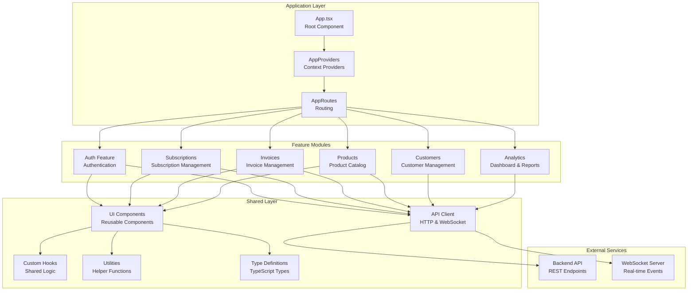

### Feature Module Structure

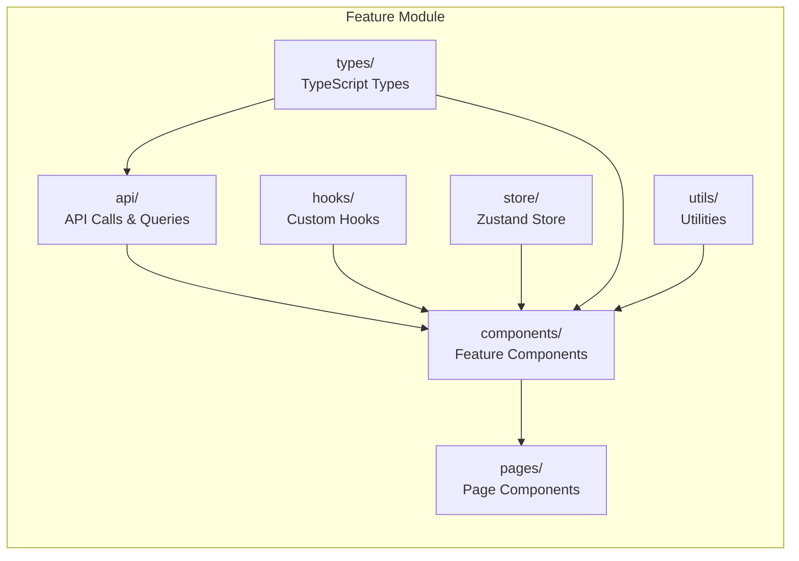

---

## State Management

### Overview

The application uses a **hybrid state management approach** with three distinct layers:

1. **Global State (Zustand)**: Authentication and user context
2. **Server State (React Query)**: API data, caching, and synchronization
3. **Local State (React Hooks)**: Component-specific UI state

### State Management Architecture

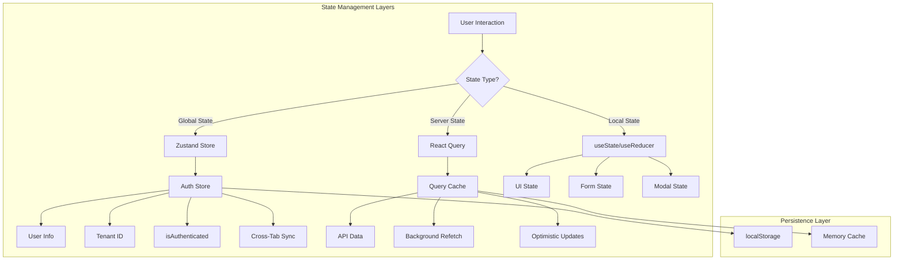

### 1. Global State - Zustand Store

#### Auth Store Structure

```typescript
interface AuthStore {
    // State
    user: User | null;
    tenantId: string | null;
    isAuthenticated: boolean;
    isInitialized: boolean;
    
    // Computed values
    hasAccessToken: () => boolean;
    
    // Actions
    login: (credentials: { email: string; password: string }) => Promise<void>;
    register: (credentials: RegisterCredentials) => Promise<void>;
    logout: () => Promise<void>;
    logoutAll: () => Promise<void>;
    setUser: (user: User) => void;
    setTenantId: (tenantId: string) => void;
    initialize: () => Promise<void>;
}
```

#### Store Implementation Details

**Initialization:**
- On app start, checks localStorage for existing tokens
- Validates token and refresh token
- Restores user state if valid tokens exist
- Sets `isInitialized` flag to prevent flash of unauthenticated content

**Login Flow:**
1. User submits credentials
2. API call to `/auth/login`
3. Receive tokens and user data
4. Store tokens in TokenManager (localStorage)
5. Update Zustand store state
6. Broadcast login event to other tabs via BroadcastChannel

**Cross-Tab Synchronization:**
- Uses BroadcastChannel API for multi-tab communication
- When user logs in/out in one tab, all other tabs update automatically
- Prevents inconsistent authentication state across tabs

**Token Management:**
- Access token stored in memory (TokenManager class)
- Refresh token stored in localStorage
- Automatic token refresh on 401 responses
- Token refresh queue prevents race conditions

### 2. Server State - React Query

#### Query Client Configuration

```typescript
export const queryClient = new QueryClient({
    defaultOptions: {
        queries: {
            staleTime: 30000,        // 30 seconds - data considered fresh
            gcTime: 300000,          // 5 minutes - cache garbage collection
            retry: 1,                // Retry failed requests once
            refetchOnWindowFocus: false, // Don't refetch on window focus
        },
        mutations: {
            retry: 0,                // Don't retry mutations
        },
    },
});
```

#### Query Hook Pattern

```typescript
export const useSubscriptions = (filters: SubscriptionFilters) => {
    const isAuthenticated = useAuthStore((state) => state.isAuthenticated);
    const hasAccessToken = useAuthStore((state) => state.hasAccessToken);
    
    return useQuery({
        queryKey: ['subscriptions', filters],  // Unique cache key
        queryFn: () => subscriptionsApi.getAll(filters),
        enabled: isAuthenticated && hasAccessToken(),  // Conditional fetching
        retry: false,
        refetchOnWindowFocus: false,
        staleTime: 30000,
        gcTime: 300000,
    });
};
```

#### Mutation Hook Pattern with Optimistic Updates

```typescript
export const useUpdateSubscription = () => {
    const queryClient = useQueryClient();

    return useMutation({
        mutationFn: ({ id, data }: { id: string; data: Partial<any> }) =>
            subscriptionsApi.update(id, data),
        
        // Optimistic Update - Update UI immediately
        onMutate: async ({ id, data }) => {
            // Cancel outgoing queries to prevent race conditions
            await queryClient.cancelQueries({ queryKey: ['subscriptions', id] });
            
            // Snapshot previous value for rollback
            const previous = queryClient.getQueryData(['subscriptions', id]);
            
            // Optimistically update cache
            queryClient.setQueryData(['subscriptions', id], (old: any) => ({
                ...old,
                ...data,
            }));
            
            return { previous };
        },
        
        // Rollback on error
        onError: (_err, { id }, context) => {
            if (context?.previous) {
                queryClient.setQueryData(['subscriptions', id], context.previous);
            }
        },
        
        // Invalidate and refetch on success
        onSettled: (data) => {
            if (data) {
                queryClient.invalidateQueries({ queryKey: ['subscriptions', data.id] });
                queryClient.invalidateQueries({ queryKey: ['subscriptions'] });
            }
        },
    });
};
```

#### React Query Cache Strategy

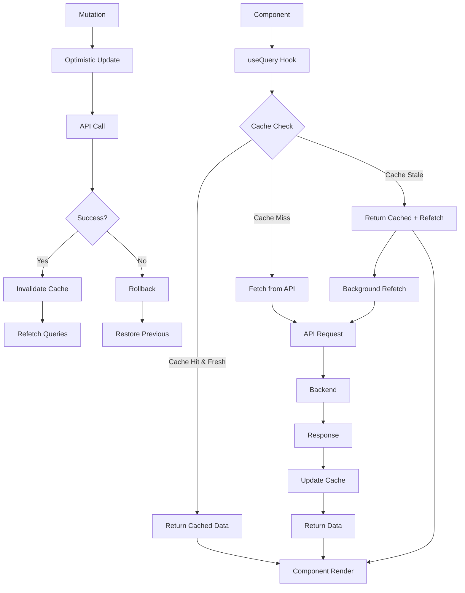

### 3. Local State Management

#### Component-Level State

Components use `useState` and `useReducer` for:
- UI state (modals, dropdowns, toggles)
- Form state (handled by React Hook Form)
- Temporary calculations
- Component-specific preferences

**Example:**
```typescript
const Header: FC = () => {
    // UI State
    const [isNotificationsOpen, setIsNotificationsOpen] = useState(false);
    const [isCreateDialogOpen, setIsCreateDialogOpen] = useState(false);
    const [searchQuery, setSearchQuery] = useState('');
    
    // Server State (React Query)
    const { data: unreadCount } = useUnreadCount();
    
    // Global State (Zustand)
    const user = useAuthStore((state) => state.user);
    
    // ...
};
```

### 4. State Persistence

#### localStorage Usage

| Key | Purpose | Managed By |
|-----|---------|-----------|
| `accessToken` | JWT access token | TokenManager |
| `refreshToken` | JWT refresh token | TokenManager |
| `sessionId` | Current session ID | TokenManager |
| `userId` | Current user ID | TokenManager |
| `role` | User role | TokenManager |
| `userEmail` | User email | Auth Store |
| `selectedTenantId` | Current tenant | Auth Store |
| `sidebarOpen` | Sidebar state preference | AppLayout |

#### Memory State

- **Zustand Store**: Runtime only, rehydrated from localStorage on init
- **React Query Cache**: Runtime only, cleared on page refresh (5 min TTL)

### 5. Data Flow Architecture

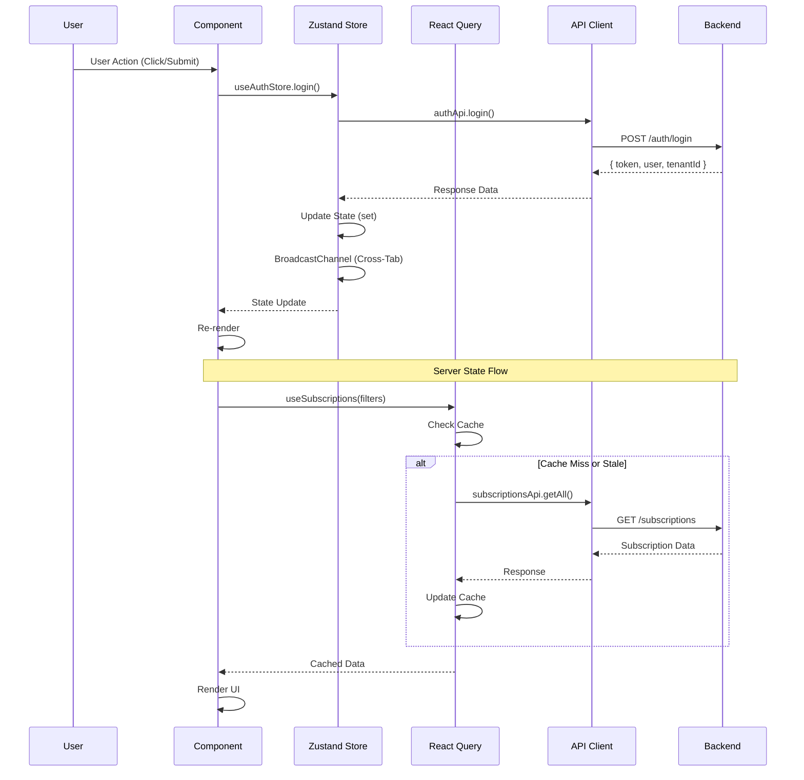

### 6. Authentication Flow

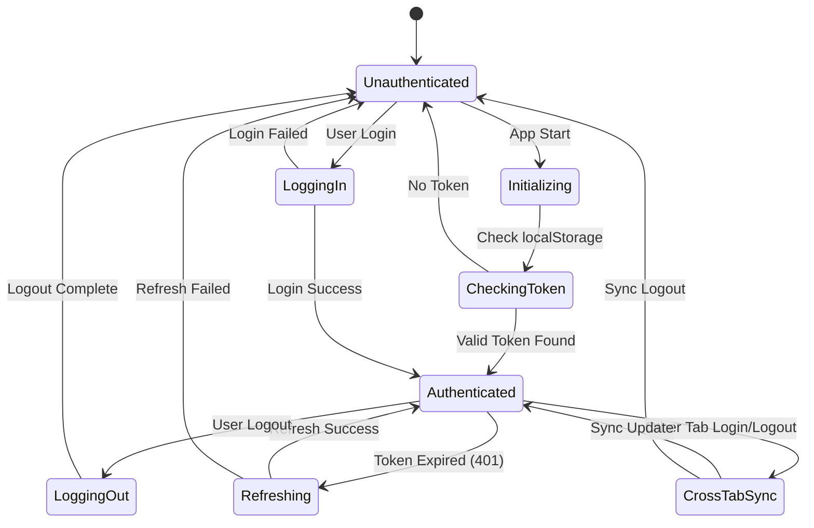

---

## Component Hierarchy

### Root Component Tree

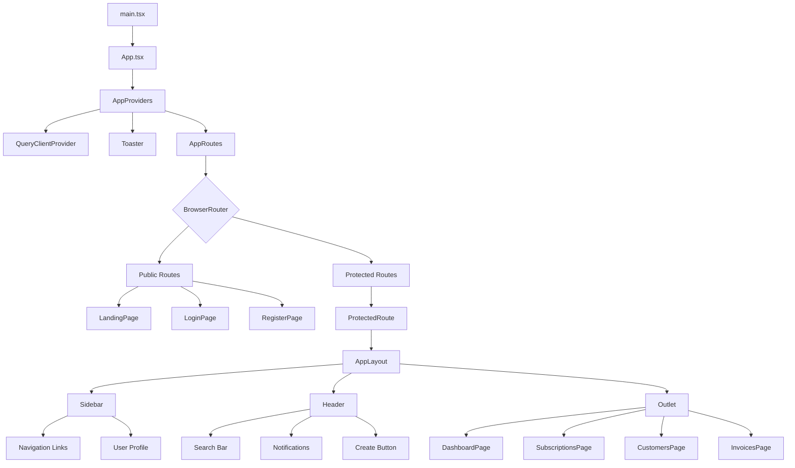

### AppLayout Structure

```
<AppLayout>
├── <Sidebar>
│   ├── Logo
│   ├── Navigation Links
│   │   ├── Dashboard
│   │   ├── Customers
│   │   ├── Subscriptions
│   │   ├── Invoices
│   │   └── Product Catalog
│   ├── Developer Section
│   │   ├── Webhooks
│   │   └── Settings
│   └── User Profile Dropdown
│       ├── User Info
│       ├── Account Settings
│       ├── Active Sessions
│       ├── Logout
│       └── Logout All
│
├── <Header>
│   ├── Menu Toggle Button
│   ├── Search Input
│   ├── Notifications Dropdown
│   │   └── <NotificationDropdown>
│   └── Create Button
│       └── <CreateSubscriptionDialog>
│
└── <Outlet /> (Page Content)
    └── Current Route Component
```

### Component Composition Pattern

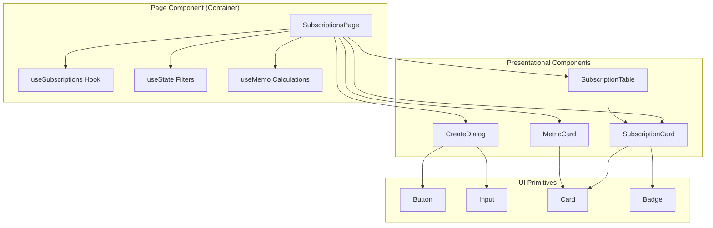

### Component Categories

#### 1. Layout Components
- `AppLayout` - Main layout wrapper with sidebar and header
- `Header` - Top navigation bar with search and actions
- `Sidebar` - Side navigation menu with user profile

#### 2. Page Components (Containers)
- `DashboardPage` - Analytics dashboard
- `SubscriptionsPage` - Subscription list and management
- `CustomersPage` - Customer list and management
- `InvoicesPage` - Invoice list and management
- `ProductsPage` - Product catalog
- `WebhooksPage` - Webhook management
- `SettingsPage` - Application settings
- `LoginPage` - Authentication page
- `RegisterPage` - Registration page

#### 3. Feature Components
- `CreateSubscriptionDialog` - Subscription creation form
- `SubscriptionCard` - Subscription display card
- `RevenueRecognitionChart` - Revenue visualization
- `NotificationDropdown` - Notification list
- `CreateCustomerDialog` - Customer creation form
- `CreateInvoiceDialog` - Invoice creation form
- `CreateProductDialog` - Product creation form
- `CreateWebhookDialog` - Webhook creation form

#### 4. UI Primitives
- `Button` - Button component with variants
- `Input` - Text input component
- `Card` - Card container component
- `Badge` - Status badge component
- `Toast` - Notification toast
- `Dialog` - Modal dialog (Radix UI)
- `Select` - Dropdown select (Radix UI)
- `Tabs` - Tab navigation (Radix UI)

#### 5. Utility Components
- `ProtectedRoute` - Route guard component
- `CookieConsentBanner` - Cookie consent UI
- `ConfirmationDialog` - Confirmation modal

---

## API Integration

### API Client Architecture

The application uses a centralized Axios instance with interceptors for:
- Automatic token injection
- Tenant ID header injection
- Token refresh on 401 errors
- Error handling and transformation

### API Client Structure

```typescript
// src/shared/api/apiClient.ts

export const apiClient = axios.create({
    baseURL: API_BASE_URL,
    headers: {
        'Content-Type': 'application/json',
        'Accept': 'application/json',
    },
    withCredentials: CORS_CONFIG.withCredentials,
});
```

### Request Interceptor

```typescript
apiClient.interceptors.request.use((config) => {
    const url = config.url || '';
    const isPublicEndpoint = url.includes('/tenants/register') || 
                            url.includes('/auth/login');

    if (!isPublicEndpoint) {
        // Add Tenant ID header
        const tenantId = useAuthStore.getState().tenantId;
        if (tenantId) {
            config.headers['X-Tenant-ID'] = tenantId;
        }

        // Add Authorization token
        const token = tokenManager.getToken();
        if (token) {
            config.headers.Authorization = `Bearer ${token}`;
        }
    }

    return config;
});
```

### Response Interceptor

The response interceptor handles:
1. **Token Refresh**: Automatic refresh on 401 errors
2. **Request Queue**: Queues failed requests during token refresh
3. **Error Transformation**: Converts errors to user-friendly messages

```typescript
apiClient.interceptors.response.use(
    (response) => response,
    async (error) => {
        const originalRequest = error.config;

        // Handle token refresh
        if (error.response?.status === 401 && !originalRequest._retry) {
            if (isRefreshing) {
                // Queue request if refresh in progress
                return new Promise((resolve, reject) => {
                    failedQueue.push({ resolve, reject });
                })
                    .then((token) => {
                        originalRequest.headers.Authorization = `Bearer ${token}`;
                        return apiClient(originalRequest);
                    })
                    .catch((err) => Promise.reject(err));
            }

            originalRequest._retry = true;
            isRefreshing = true;

            try {
                const refreshToken = tokenManager.getRefreshToken();
                if (!refreshToken) {
                    throw new Error('No refresh token available');
                }

                const response = await axios.post(
                    `${API_BASE_URL}/auth/refresh`,
                    { refreshToken },
                    { /* config */ }
                );

                const { token, refreshToken: newRefreshToken, sessionId } = response.data;

                // Update tokens
                tokenManager.setToken(token);
                tokenManager.setRefreshToken(newRefreshToken);
                tokenManager.setSessionId(sessionId);

                // Update default headers
                apiClient.defaults.headers.common.Authorization = `Bearer ${token}`;
                originalRequest.headers.Authorization = `Bearer ${token}`;

                // Process queued requests
                processQueue(null, token);
                return apiClient(originalRequest);
            } catch (refreshError) {
                processQueue(refreshError, null);
                useAuthStore.getState().logout();
                window.location.href = '/login';
                return Promise.reject(refreshError);
            } finally {
                isRefreshing = false;
            }
        }

        return Promise.reject(error);
    }
);
```

### API Integration Flow

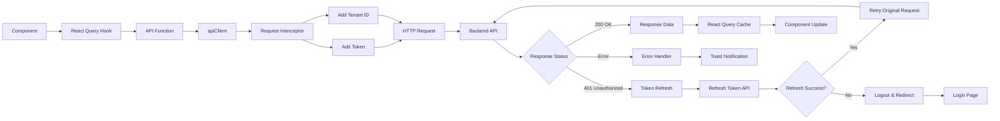

### API Endpoint Organization

Endpoints are organized in a centralized constants file:

```typescript
// src/shared/constants/apiEndpoints.ts

export const API_ROUTES = {
    AUTH: {
        LOGIN: '/auth/login',
        REFRESH: '/auth/refresh',
        LOGOUT: '/auth/logout',
        LOGOUT_ALL: '/auth/logout-all',
        SESSIONS: '/auth/sessions',
    },
    SUBSCRIPTIONS: {
        BASE: '/subscriptions',
        CREATE: '/subscriptions',
        GET: (id: string) => `/subscriptions/${id}`,
        CANCEL: (id: string) => `/subscriptions/${id}/cancel`,
        PAUSE: (id: string) => `/subscriptions/${id}/pause`,
        RESUME: (id: string) => `/subscriptions/${id}/resume`,
    },
    // ... other endpoints
};
```

### API Function Pattern

```typescript
// features/subscriptions/api/subscriptionsApi.ts

export const subscriptionsApi = {
    getAll: async (filters: SubscriptionFilters): Promise<PaginatedResponse<Subscription>> => {
        const response = await apiClient.get(API_ROUTES.SUBSCRIPTIONS.BASE, {
            params: filters,
        });
        return response.data;
    },
    
    getById: async (id: string): Promise<Subscription> => {
        const response = await apiClient.get(API_ROUTES.SUBSCRIPTIONS.GET(id));
        return response.data;
    },
    
    create: async (data: CreateSubscriptionInput): Promise<Subscription> => {
        const response = await apiClient.post(API_ROUTES.SUBSCRIPTIONS.CREATE, data);
        return response.data;
    },
    
    update: async (id: string, data: Partial<Subscription>): Promise<Subscription> => {
        const response = await apiClient.put(API_ROUTES.SUBSCRIPTIONS.GET(id), data);
        return response.data;
    },
    
    cancel: async (id: string, immediately: boolean, reason?: string): Promise<Subscription> => {
        const response = await apiClient.post(API_ROUTES.SUBSCRIPTIONS.CANCEL(id), {
            immediately,
            reason,
        });
        return response.data;
    },
};
```

---

## Routing & Navigation

### Route Structure

The application uses React Router v6 with:
- Public routes (landing, login, register)
- Protected routes (dashboard, subscriptions, etc.)
- Nested routes with layout
- Route guards for authentication

### Route Configuration

```typescript
// src/app/AppRoutes.tsx

<BrowserRouter>
    <Routes>
        {/* Public Routes */}
        <Route path="/" element={<RootRedirect />} />
        <Route path={ROUTES.LOGIN} element={<LoginPage />} />
        <Route path={ROUTES.REGISTER} element={<RegisterPage />} />
        <Route path={ROUTES.PRIVACY_POLICY} element={<PrivacyPolicyPage />} />
        <Route path={ROUTES.TERMS_OF_SERVICE} element={<TermsOfServicePage />} />
        <Route path={ROUTES.COOKIE_POLICY} element={<CookiePolicyPage />} />

        {/* Protected Routes */}
        <Route
            element={
                <ProtectedRoute>
                    <AppLayout />
                </ProtectedRoute>
            }
        >
            <Route path={ROUTES.DASHBOARD} element={<DashboardPage />} />
            <Route path={ROUTES.SUBSCRIPTIONS} element={<SubscriptionsPage />} />
            <Route path={ROUTES.CREATE_SUBSCRIPTION} element={<CreateSubscriptionPage />} />
            <Route path={ROUTES.SUBSCRIPTION_DETAIL} element={<SubscriptionDetailPage />} />
            <Route path={ROUTES.CUSTOMERS} element={<CustomersPage />} />
            <Route path={ROUTES.CUSTOMER_DETAIL} element={<CustomerDetailPage />} />
            <Route path={ROUTES.INVOICES} element={<InvoicesPage />} />
            <Route path={ROUTES.INVOICE_DETAIL} element={<InvoiceDetailPage />} />
            <Route path={ROUTES.PAYMENTS} element={<PaymentsPage />} />
            <Route path={ROUTES.PAYMENT_DETAIL} element={<PaymentDetailPage />} />
            <Route path={ROUTES.PRODUCTS} element={<ProductsPage />} />
            <Route path={ROUTES.PRODUCT_DETAIL} element={<ProductDetailPage />} />
            <Route path={ROUTES.WEBHOOKS} element={<WebhooksPage />} />
            <Route path={ROUTES.SETTINGS} element={<SettingsPage />} />
            <Route path={ROUTES.SESSIONS} element={<SessionsPage />} />
            <Route path={ROUTES.NOTIFICATIONS} element={<NotificationsPage />} />
        </Route>
    </Routes>
</BrowserRouter>
```

### Protected Route Implementation

```typescript
// features/auth/components/ProtectedRoute.tsx

export const ProtectedRoute: FC<ProtectedRouteProps> = ({ children }) => {
    const isAuthenticated = useAuthStore((state) => state.isAuthenticated);
    const isInitialized = useAuthStore((state) => state.isInitialized);
    const location = useLocation();

    // Show loading while checking authentication
    if (!isInitialized) {
        return (
            <div className="flex items-center justify-center min-h-screen">
                <div className="text-slate-500">Loading...</div>
            </div>
        );
    }

    // Redirect to login if not authenticated
    if (!isAuthenticated) {
        return <Navigate to={ROUTES.LOGIN} state={{ from: location }} replace />;
    }

    return <>{children}</>;
};
```

### Route Constants

```typescript
// src/shared/constants/routes.ts

export const ROUTES = {
    HOME: '/',
    LOGIN: '/login',
    REGISTER: '/register',
    DASHBOARD: '/dashboard',
    SUBSCRIPTIONS: '/subscriptions',
    SUBSCRIPTION_DETAIL: '/subscriptions/:id',
    CREATE_SUBSCRIPTION: '/subscriptions/new',
    CUSTOMERS: '/customers',
    CUSTOMER_DETAIL: '/customers/:id',
    INVOICES: '/invoices',
    INVOICE_DETAIL: '/invoices/:id',
    PAYMENTS: '/payments',
    PAYMENT_DETAIL: '/payments/:id',
    PRODUCTS: '/products',
    PRODUCT_DETAIL: '/products/:id',
    WEBHOOKS: '/webhooks',
    SETTINGS: '/settings',
    SESSIONS: '/sessions',
    NOTIFICATIONS: '/notifications',
    PRIVACY_POLICY: '/privacy',
    TERMS_OF_SERVICE: '/terms',
    COOKIE_POLICY: '/cookies',
};
```

### Navigation Patterns

**Programmatic Navigation:**
```typescript
const navigate = useNavigate();

// Navigate to route
navigate(ROUTES.SUBSCRIPTIONS);

// Navigate with state
navigate(ROUTES.SUBSCRIPTION_DETAIL.replace(':id', subscriptionId), {
    state: { subscription },
});

// Navigate with query params
navigate(`${ROUTES.INVOICES}?status=open&page=1`);
```

**Link Navigation:**
```typescript
import { Link } from 'react-router-dom';

<Link to={ROUTES.DASHBOARD}>Dashboard</Link>
```

**Active Route Detection:**
```typescript
const location = useLocation();
const isActive = location.pathname === ROUTES.DASHBOARD;
```

---

## Styling & UI/UX

### Styling Approach

The application uses **Tailwind CSS 3.4** with a utility-first approach, combined with:
- CSS Variables for theming
- Dark mode support
- Custom Tailwind configuration
- Radix UI for accessible components

### Tailwind Configuration

```javascript
// tailwind.config.js

export default {
    darkMode: ['class'],
    content: ['./index.html', './src/**/*.{js,ts,jsx,tsx}'],
    theme: {
        extend: {
            colors: {
                primary: {
                    DEFAULT: '#3c83f6',
                    foreground: 'hsl(var(--primary-foreground))',
                    dark: '#2563eb',
                },
                'background-light': '#f5f7f8',
                'background-dark': '#101722',
                'sidebar-bg': '#0f172a',
                'surface-dark': '#161e2c',
                'border-dark': '#2a3441',
                // ... more colors
            },
            fontFamily: {
                sans: ['Inter', 'sans-serif'],
            },
            borderRadius: {
                lg: 'var(--radius)',
                md: 'calc(var(--radius) - 2px)',
                sm: 'calc(var(--radius) - 4px)',
            },
        },
    },
    plugins: [],
};
```

### CSS Variables (Theme System)

```css
/* src/styles/globals.css */

:root {
    --background: 0 0% 100%;
    --foreground: 222.2 84% 4.9%;
    --primary: 221 83% 58%;
    --primary-foreground: 210 40% 98%;
    --secondary: 210 40% 96.1%;
    --muted: 210 40% 96.1%;
    --accent: 210 40% 96.1%;
    --destructive: 0 84.2% 60.2%;
    --border: 214.3 31.8% 91.4%;
    --input: 214.3 31.8% 91.4%;
    --ring: 221 83% 58%;
    --radius: 0.5rem;
}

.dark {
    --background: 222.2 84% 4.9%;
    --foreground: 210 40% 98%;
    --primary: 221 83% 58%;
    --secondary: 217.2 32.6% 17.5%;
    --muted: 217.2 32.6% 17.5%;
    --destructive: 0 62.8% 30.6%;
    --border: 217.2 32.6% 17.5%;
    --input: 217.2 32.6% 17.5%;
}
```

### Dark Mode Support

Dark mode is implemented using class-based toggling:
- Toggle via `.dark` class on root element
- CSS variables automatically switch
- All components support both themes
- Custom scrollbar styling for dark mode

### Responsive Design

The application uses Tailwind's responsive breakpoints:
- `sm`: 640px (small tablets)
- `md`: 768px (tablets)
- `lg`: 1024px (desktops)
- `xl`: 1280px (large desktops)
- `2xl`: 1536px (extra large desktops)

**Responsive Patterns:**
```typescript
// Mobile-first approach
<div className="
    p-4          // Mobile: 1rem
    sm:p-6       // Small: 1.5rem
    md:p-8       // Medium: 2rem
    lg:p-10      // Large: 2.5rem
">
```

### Component Styling Patterns

**Utility Classes:**
```typescript
<div className="
    flex items-center justify-between
    p-4 bg-white dark:bg-slate-800
    rounded-lg shadow-sm
    border border-slate-200 dark:border-slate-700
    hover:shadow-md transition-shadow
">
```

**Conditional Classes:**
```typescript
import { cn } from '@/shared/utils/cn';

<button className={cn(
    "px-4 py-2 rounded-lg",
    isActive 
        ? "bg-primary text-white" 
        : "bg-slate-100 text-slate-700 hover:bg-slate-200"
)}>
```

### Icon System

The application uses two icon systems:
1. **Lucide React**: Modern, customizable icons
2. **Material Symbols**: Icon font for additional icons

**Usage:**
```typescript
// Lucide React
import { Search, Bell, User } from 'lucide-react';

<Search className="w-5 h-5" />

// Material Symbols
<span className="material-symbols-outlined" style={{ fontSize: '24px' }}>
    dashboard
</span>
```

---

## Form Management

### React Hook Form Integration

Forms are managed using React Hook Form for:
- Performance (uncontrolled components)
- Minimal re-renders
- Built-in validation
- Easy error handling

### Form Pattern

```typescript
import { useForm } from 'react-hook-form';
import { zodResolver } from '@hookform/resolvers/zod';
import { z } from 'zod';

// Zod Schema
const subscriptionSchema = z.object({
    customerId: z.string().uuid('Invalid customer ID'),
    priceId: z.string().uuid('Invalid price ID'),
    quantity: z.number().min(1, 'Quantity must be at least 1'),
    trialDays: z.number().min(0).max(365).optional(),
});

type SubscriptionFormData = z.infer<typeof subscriptionSchema>;

// Form Component
const CreateSubscriptionForm = () => {
    const {
        register,
        handleSubmit,
        formState: { errors, isSubmitting },
        control,
    } = useForm<SubscriptionFormData>({
        resolver: zodResolver(subscriptionSchema),
        defaultValues: {
            quantity: 1,
            trialDays: 14,
        },
    });

    const createMutation = useCreateSubscription();

    const onSubmit = async (data: SubscriptionFormData) => {
        try {
            await createMutation.mutateAsync(data);
            toast({
                title: 'Success',
                description: 'Subscription created successfully',
            });
        } catch (error) {
            toast({
                variant: 'destructive',
                title: 'Error',
                description: 'Failed to create subscription',
            });
        }
    };

    return (
        <form onSubmit={handleSubmit(onSubmit)}>
            <div>
                <label>Customer</label>
                <select {...register('customerId')}>
                    {/* options */}
                </select>
                {errors.customerId && (
                    <span className="text-red-500">{errors.customerId.message}</span>
                )}
            </div>
            {/* more fields */}
            <button type="submit" disabled={isSubmitting}>
                Create Subscription
            </button>
        </form>
    );
};
```

### Form Validation

Validation is handled by Zod schemas:
- Type-safe validation
- Runtime type checking
- Custom error messages
- Nested object validation

---

## Error Handling

### Error Handling Strategy

The application implements a multi-layer error handling approach:

1. **API Level**: Axios interceptors catch HTTP errors
2. **Query Level**: React Query handles query errors
3. **Component Level**: Try-catch blocks for local errors
4. **User Level**: Toast notifications for user feedback

### Error Handling Patterns

**API Errors:**
```typescript
// Automatic handling in interceptors
apiClient.interceptors.response.use(
    (response) => response,
    async (error) => {
        if (error.response?.status === 401) {
            // Handle token refresh
        }
        return Promise.reject(error);
    }
);
```

**Query Errors:**
```typescript
const { data, error, isLoading } = useSubscriptions(filters);

if (error) {
    return (
        <div className="error-container">
            <p>Failed to load subscriptions</p>
            <button onClick={() => refetch()}>Retry</button>
        </div>
    );
}
```

**Component Errors:**
```typescript
try {
    await createMutation.mutateAsync(data);
} catch (error) {
    toast({
        variant: 'destructive',
        title: 'Error',
        description: error.message || 'An error occurred',
    });
}
```

### Error Types

- **Network Errors**: Connection failures, timeouts
- **HTTP Errors**: 400, 401, 403, 404, 500, etc.
- **Validation Errors**: Form validation failures
- **Business Logic Errors**: Application-specific errors

---

## Performance Optimizations

### Code Splitting

Vite configuration includes manual chunk splitting:

```typescript
// vite.config.ts

export default defineConfig({
    build: {
        rollupOptions: {
            output: {
                manualChunks: {
                    vendor: ['react', 'react-dom', 'react-router-dom'],
                    ui: ['@radix-ui/react-dialog', '@radix-ui/react-dropdown-menu'],
                    data: ['axios', '@tanstack/react-query', 'zustand'],
                    charts: ['recharts'],
                },
            },
        },
    },
});
```

### React Query Optimizations

- **Stale Time**: 30 seconds (data considered fresh)
- **Cache Time**: 5 minutes (garbage collection)
- **Background Refetching**: Automatic stale data refresh
- **Query Deduplication**: Automatic request deduplication

### Memoization

**useMemo for Expensive Calculations:**
```typescript
const mrr = useMemo(() => calculateMRR(subscriptions), [subscriptions]);
const filteredData = useMemo(() => 
    data.filter(item => item.status === filter), 
    [data, filter]
);
```

**useCallback for Stable References:**
```typescript
const handleClick = useCallback(() => {
    // handler logic
}, [dependencies]);
```

### Virtual Scrolling

For large lists, TanStack Virtual is available:
```typescript
import { useVirtualizer } from '@tanstack/react-virtual';

const virtualizer = useVirtualizer({
    count: items.length,
    getScrollElement: () => parentRef.current,
    estimateSize: () => 80,
});
```

### Image Optimization

- Lazy loading for images
- Optimized image formats
- Responsive image sizes

---

## Testing Strategy

### Testing Tools

- **Vitest**: Test runner (Vite-native)
- **React Testing Library**: Component testing
- **jsdom**: DOM environment for tests
- **@testing-library/user-event**: User interaction simulation

### Test Configuration

```typescript
// vitest.config.ts

export default defineConfig({
    plugins: [react()],
    test: {
        globals: true,
        environment: 'jsdom',
        setupFiles: './src/test/setup.ts',
        coverage: {
            provider: 'v8',
            reporter: ['text', 'json', 'html', 'lcov'],
            exclude: [
                'node_modules/',
                'src/test/',
                '**/*.d.ts',
                '**/*.config.*',
            ],
        },
    },
});
```

### Test Types

#### Unit Tests

**Utility Functions:**
```typescript
// src/shared/utils/currencyHelpers.test.ts

import { describe, it, expect } from 'vitest';
import { formatCurrency } from './currencyHelpers';

describe('formatCurrency', () => {
    it('should format USD correctly', () => {
        expect(formatCurrency(2999, 'USD')).toBe('$29.99');
    });
});
```

**Custom Hooks:**
```typescript
// src/shared/hooks/useDebounce.test.ts

import { renderHook, waitFor } from '@testing-library/react';
import { useDebounce } from './useDebounce';

describe('useDebounce', () => {
    it('should debounce value changes', async () => {
        const { result, rerender } = renderHook(
            ({ value }) => useDebounce(value, 300),
            { initialProps: { value: 'test' } }
        );

        expect(result.current).toBe('test');
        
        rerender({ value: 'updated' });
        expect(result.current).toBe('test'); // Still old value
        
        await waitFor(() => {
            expect(result.current).toBe('updated');
        }, { timeout: 400 });
    });
});
```

#### Component Tests

```typescript
// src/features/auth/components/ProtectedRoute.test.tsx

import { render, screen } from '@testing-library/react';
import { ProtectedRoute } from './ProtectedRoute';
import { useAuthStore } from '../store/authStore';

describe('ProtectedRoute', () => {
    it('should redirect to login when not authenticated', () => {
        useAuthStore.setState({ isAuthenticated: false, isInitialized: true });
        
        render(
            <ProtectedRoute>
                <div>Protected Content</div>
            </ProtectedRoute>
        );
        
        // Should redirect to login
        expect(window.location.pathname).toBe('/login');
    });
});
```

#### API Tests

```typescript
// src/features/subscriptions/api/subscriptionsApi.test.ts

import { describe, it, expect, vi } from 'vitest';
import { subscriptionsApi } from './subscriptionsApi';
import { apiClient } from '@/shared/api/apiClient';

vi.mock('@/shared/api/apiClient');

describe('subscriptionsApi', () => {
    it('should fetch all subscriptions', async () => {
        const mockData = { content: [], totalElements: 0 };
        vi.mocked(apiClient.get).mockResolvedValue({ data: mockData });
        
        const result = await subscriptionsApi.getAll({ page: 0, size: 20 });
        
        expect(result).toEqual(mockData);
        expect(apiClient.get).toHaveBeenCalledWith('/subscriptions', {
            params: { page: 0, size: 20 },
        });
    });
});
```

### Test Coverage

Current test coverage includes:
- Utility functions (100%)
- Custom hooks (100%)
- API functions (partial)
- Components (partial)
- Store logic (partial)

**Coverage Goals:**
- Unit tests: >80%
- Component tests: >70%
- Integration tests: >60%

---

## Build & Deployment

### Build Configuration

**Vite Configuration:**
```typescript
// vite.config.ts

import { defineConfig } from 'vite';
import react from '@vitejs/plugin-react';
import path from 'path';

export default defineConfig({
    plugins: [react()],
    resolve: {
        alias: {
            '@': path.resolve(__dirname, './src'),
        },
    },
    build: {
        rollupOptions: {
            output: {
                manualChunks: {
                    vendor: ['react', 'react-dom', 'react-router-dom'],
                    ui: ['@radix-ui/react-dialog', '@radix-ui/react-dropdown-menu'],
                    data: ['axios', '@tanstack/react-query', 'zustand'],
                    charts: ['recharts'],
                },
            },
        },
    },
    server: {
        proxy: {
            '/api': {
                target: 'http://localhost:8080',
                changeOrigin: true,
            },
        },
    },
});
```

### Environment Variables

**Required Variables:**
```bash
VITE_API_BASE_URL=http://localhost:8080/api
VITE_WS_URL=ws://localhost:8080/ws
VITE_STRIPE_PUBLISHABLE_KEY=pk_test_...
VITE_ENVIRONMENT=development
VITE_CORS_WITH_CREDENTIALS=false
VITE_CORS_CREDENTIALS=include
VITE_CORS_MODE=cors
```

**Environment Configuration:**
```typescript
// src/shared/constants/config.ts

export const API_BASE_URL = import.meta.env.VITE_API_BASE_URL || 'http://localhost:8080/api';
export const WS_URL = import.meta.env.VITE_WS_URL || 'ws://localhost:8080/ws';
export const STRIPE_PUBLISHABLE_KEY = import.meta.env.VITE_STRIPE_PUBLISHABLE_KEY || '';
export const ENVIRONMENT = import.meta.env.VITE_ENVIRONMENT || 'development';

export const CORS_CONFIG = {
    withCredentials: import.meta.env.VITE_CORS_WITH_CREDENTIALS === 'true',
    credentials: import.meta.env.VITE_CORS_CREDENTIALS || 'include',
    mode: (import.meta.env.VITE_CORS_MODE || 'cors') as RequestMode,
};
```

**Note:** All environment variables must be prefixed with `VITE_` to be accessible in Vite applications.

### Deployment Strategy

1. **Build Process:**
   ```bash
   npm run build
   ```
   - TypeScript compilation (`tsc`)
   - Vite build with code splitting
   - Output to `dist/` directory

2. **Static Hosting:**
   - Static files served from `dist/`
   - SPA routing requires server configuration
   - All routes redirect to `index.html`

3. **CI/CD Integration:**
   - GitHub Actions workflows configured
   - Automated testing on push/PR
   - Code quality checks (ESLint, TypeScript)
   - Security scanning (CodeQL, Trivy)

---

## Project Statistics

### Component Count

| Category | Count | Description |
|----------|-------|-------------|
| **Pages** | 22 | Route handler components |
| **Feature Components** | ~35+ | Feature-specific UI components |
| **Shared UI Components** | 10 | Reusable UI primitives |
| **Layout Components** | 3 | App layout structure |
| **Total Components** | ~70+ | All React components |

### Route Count

| Type | Count | Routes |
|------|-------|--------|
| **Public Routes** | 7 | Landing, Login, Register, Legal pages |
| **Protected Routes** | 15 | Dashboard, Subscriptions, Customers, etc. |
| **Total Routes** | 24 | All application routes |

### Custom Hooks

| Type | Count | Examples |
|------|-------|----------|
| **Shared Hooks** | 2 | `useDebounce`, `useLocalStorage` |
| **Feature Hooks** | 1 | `useAuth` |
| **React Query Hooks** | ~30+ | `useSubscriptions`, `useInvoices`, etc. |
| **Total Hooks** | ~33+ | All custom hooks |

### Utility Functions

| Category | Count | Files |
|----------|-------|-------|
| **Shared Utils** | 6 | `cn`, `currencyHelpers`, `dateHelpers`, `permissions` |
| **Feature Utils** | 3+ | `tokenManager`, `errorHandler`, `crossTabSync`, `subscriptionHelpers` |
| **Total Utils** | ~9+ | All utility modules |

### Test Files

| Type | Count | Coverage |
|------|-------|----------|
| **Unit Tests** | 17 | `.test.ts` files |
| **Component Tests** | 2 | `.test.tsx` files |
| **Total Test Files** | 19 | Test coverage modules |

### Code Metrics

- **TypeScript Coverage**: 100% (strict mode)
- **Test Coverage**: Partial (utilities and hooks have high coverage)
- **ESLint Warnings**: 0 (strict configuration)
- **Bundle Size**: Optimized with code splitting

---

## Best Practices

### 1. Component Design

**✅ DO:**
- Use functional components with hooks
- Keep components small and focused
- Extract reusable logic into custom hooks
- Use TypeScript for type safety
- Follow single responsibility principle

**❌ DON'T:**
- Mix business logic with UI logic
- Create deeply nested component structures
- Use class components (prefer functional)
- Ignore TypeScript errors
- Duplicate code across components

### 2. State Management

**✅ DO:**
- Use Zustand for global state (auth, user)
- Use React Query for server state
- Use local state for UI-only state
- Leverage React Query caching
- Use optimistic updates for better UX

**❌ DON'T:**
- Store server data in global state
- Duplicate API data in multiple stores
- Ignore React Query cache invalidation
- Use global state for temporary UI state

### 3. API Integration

**✅ DO:**
- Use centralized API client
- Handle errors consistently
- Implement automatic token refresh
- Use React Query hooks for data fetching
- Leverage query invalidation

**❌ DON'T:**
- Create multiple Axios instances
- Handle errors differently in each component
- Store tokens in global state
- Manually manage API cache
- Ignore loading and error states

### 4. TypeScript Usage

**✅ DO:**
- Define types for all props and state
- Use interfaces for object shapes
- Leverage type inference where possible
- Use generic types for reusable code
- Export types from dedicated files

**❌ DON'T:**
- Use `any` type
- Ignore TypeScript errors
- Mix JavaScript and TypeScript files
- Skip type definitions for API responses
- Use type assertions unnecessarily

### 5. Code Organization

**✅ DO:**
- Follow feature-based structure
- Keep related files together
- Use clear, descriptive names
- Maintain consistent file structure
- Document complex logic

**❌ DON'T:**
- Mix feature code in shared folders
- Create deeply nested directories
- Use ambiguous naming
- Violate established patterns
- Skip code comments for complex logic

### 6. Performance

**✅ DO:**
- Use React Query caching
- Memoize expensive calculations
- Implement code splitting
- Lazy load routes (when needed)
- Optimize bundle size

**❌ DON'T:**
- Fetch data on every render
- Create unnecessary re-renders
- Load all code upfront
- Ignore bundle size
- Skip performance monitoring

---

## Code Examples

### Complete Feature Example: Subscriptions

**1. Type Definitions:**
```typescript
// features/subscriptions/types/subscription.types.ts

export interface Subscription {
    id: string;
    tenantId: string;
    customerId: string;
    customerName?: string;
    customerEmail?: string;
    status: SubscriptionStatus;
    currentPeriodStart: string;
    currentPeriodEnd: string;
    amount: number;
    currency: string;
    productName?: string;
    createdAt: string;
    updatedAt: string;
}

export type SubscriptionStatus = 
    | 'INCOMPLETE' 
    | 'ACTIVE' 
    | 'PAST_DUE' 
    | 'CANCELED' 
    | 'PAUSED' 
    | 'TRIALING';

export interface SubscriptionFilters {
    page?: number;
    size?: number;
    status?: SubscriptionStatus;
}
```

**2. API Functions:**
```typescript
// features/subscriptions/api/subscriptionsApi.ts

import { apiClient } from '@/shared/api/apiClient';
import { API_ROUTES } from '@/shared/constants/apiEndpoints';
import { Subscription, SubscriptionFilters, CreateSubscriptionInput } from '../types/subscription.types';

export const subscriptionsApi = {
    getAll: async (filters: SubscriptionFilters): Promise<PaginatedResponse<Subscription>> => {
        const response = await apiClient.get(API_ROUTES.SUBSCRIPTIONS.BASE, {
            params: filters,
        });
        return response.data;
    },
    
    getById: async (id: string): Promise<Subscription> => {
        const response = await apiClient.get(API_ROUTES.SUBSCRIPTIONS.GET(id));
        return response.data;
    },
    
    create: async (data: CreateSubscriptionInput): Promise<Subscription> => {
        const response = await apiClient.post(API_ROUTES.SUBSCRIPTIONS.CREATE, data);
        return response.data;
    },
    
    cancel: async (id: string, immediately: boolean = false, reason?: string): Promise<Subscription> => {
        const response = await apiClient.post(API_ROUTES.SUBSCRIPTIONS.CANCEL(id), {
            immediately,
            reason,
        });
        return response.data;
    },
    
    pause: async (id: string): Promise<Subscription> => {
        const response = await apiClient.post(API_ROUTES.SUBSCRIPTIONS.PAUSE(id));
        return response.data;
    },
    
    resume: async (id: string): Promise<Subscription> => {
        const response = await apiClient.post(API_ROUTES.SUBSCRIPTIONS.RESUME(id));
        return response.data;
    },
};
```

**3. React Query Hooks:**
```typescript
// features/subscriptions/api/subscriptionsQueries.ts

import { useQuery, useMutation, useQueryClient } from '@tanstack/react-query';
import { subscriptionsApi } from './subscriptionsApi';
import { SubscriptionFilters } from '../types/subscription.types';
import { useAuthStore } from '@/features/auth/store/authStore';

export const useSubscriptions = (filters: SubscriptionFilters) => {
    const isAuthenticated = useAuthStore((state) => state.isAuthenticated);
    const hasAccessToken = useAuthStore((state) => state.hasAccessToken);
    
    return useQuery({
        queryKey: ['subscriptions', filters],
        queryFn: () => subscriptionsApi.getAll(filters),
        enabled: isAuthenticated && hasAccessToken(),
        retry: false,
        refetchOnWindowFocus: false,
        staleTime: 30000,
        gcTime: 300000,
    });
};

export const useSubscription = (id: string) => {
    const isAuthenticated = useAuthStore((state) => state.isAuthenticated);
    const hasAccessToken = useAuthStore((state) => state.hasAccessToken);
    
    return useQuery({
        queryKey: ['subscriptions', id],
        queryFn: () => subscriptionsApi.getById(id),
        enabled: isAuthenticated && hasAccessToken() && !!id,
    });
};

export const useCreateSubscription = () => {
    const queryClient = useQueryClient();

    return useMutation({
        mutationFn: subscriptionsApi.create,
        onSuccess: () => {
            queryClient.invalidateQueries({ queryKey: ['subscriptions'] });
        },
    });
};

export const useCancelSubscription = () => {
    const queryClient = useQueryClient();

    return useMutation({
        mutationFn: ({ id, immediately = false, reason }: { id: string; immediately?: boolean; reason?: string }) =>
            subscriptionsApi.cancel(id, immediately, reason),
        onSuccess: (data) => {
            queryClient.invalidateQueries({ queryKey: ['subscriptions', data.id] });
            queryClient.invalidateQueries({ queryKey: ['subscriptions'] });
        },
    });
};
```

**4. Utility Functions:**
```typescript
// features/subscriptions/utils/subscriptionHelpers.ts

import { Subscription, SubscriptionStatus } from '../types/subscription.types';
import { formatCurrency } from '@/shared/utils/currencyHelpers';

export const formatSubscriptionStatus = (status: string): string => {
    const statusMap: Record<string, string> = {
        'ACTIVE': 'Active',
        'INCOMPLETE': 'Incomplete',
        'PAST_DUE': 'Past Due',
        'CANCELED': 'Canceled',
        'PAUSED': 'Paused',
        'TRIALING': 'Trialing',
    };
    return statusMap[status.toUpperCase()] || status;
};

export const getStatusColor = (status: string): string => {
    const normalizedStatus = status.toUpperCase();
    switch (normalizedStatus) {
        case 'ACTIVE':
            return 'bg-green-100 text-green-800 dark:bg-green-900/30 dark:text-green-400';
        case 'TRIALING':
            return 'bg-blue-100 text-blue-800 dark:bg-blue-900/30 dark:text-blue-400';
        case 'PAST_DUE':
            return 'bg-red-100 text-red-800 dark:bg-red-900/30 dark:text-red-400';
        case 'CANCELED':
            return 'bg-gray-100 text-gray-800 dark:bg-gray-800 dark:text-gray-400';
        case 'PAUSED':
            return 'bg-yellow-100 text-yellow-800 dark:bg-yellow-900/30 dark:text-yellow-400';
        default:
            return 'bg-slate-100 text-slate-800 dark:bg-slate-800 dark:text-slate-400';
    }
};

export const calculateMRR = (subscriptions: Subscription[]): number => {
    return subscriptions
        .filter(sub => sub.status === 'ACTIVE' || sub.status === 'TRIALING')
        .reduce((total, sub) => {
            const amount = sub.amount || 0;
            // Convert to monthly if yearly
            if (sub.currency && sub.amount) {
                // Assuming monthly for simplicity
                return total + (amount / 100);
            }
            return total;
        }, 0);
};

export const formatNextBilling = (date: string): string => {
    if (!date) return 'N/A';
    const d = new Date(date);
    return d.toLocaleDateString('en-US', { 
        month: 'short', 
        day: 'numeric', 
        year: 'numeric' 
    });
};

export const getCustomerInitials = (name: string): string => {
    if (!name) return '??';
    return name
        .split(' ')
        .map(n => n[0])
        .join('')
        .toUpperCase()
        .slice(0, 2);
};
```

**5. Component Usage:**
```typescript
// features/subscriptions/pages/SubscriptionsPage.tsx

import { FC, useState, useMemo } from 'react';
import { useSubscriptions } from '../api/subscriptionsQueries';
import { formatSubscriptionStatus, getStatusColor } from '../utils/subscriptionHelpers';

export const SubscriptionsPage: FC = () => {
    const [filters, setFilters] = useState({ page: 0, size: 20 });
    
    const { data, isLoading, error } = useSubscriptions(filters);
    
    const subscriptions = data?.content || [];
    
    if (isLoading) return <div>Loading...</div>;
    if (error) return <div>Error loading subscriptions</div>;
    
    return (
        <div>
            <h1>Subscriptions</h1>
            <table>
                <thead>
                    <tr>
                        <th>Customer</th>
                        <th>Status</th>
                        <th>Amount</th>
                    </tr>
                </thead>
                <tbody>
                    {subscriptions.map((sub) => (
                        <tr key={sub.id}>
                            <td>{sub.customerName}</td>
                            <td>
                                <span className={getStatusColor(sub.status)}>
                                    {formatSubscriptionStatus(sub.status)}
                                </span>
                            </td>
                            <td>{formatCurrency(sub.amount, sub.currency)}</td>
                        </tr>
                    ))}
                </tbody>
            </table>
        </div>
    );
};
```

### Complete Application Flow

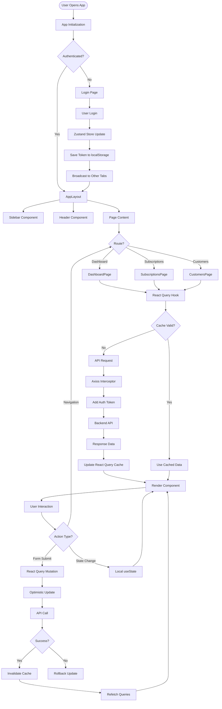

### Technology Stack Overview

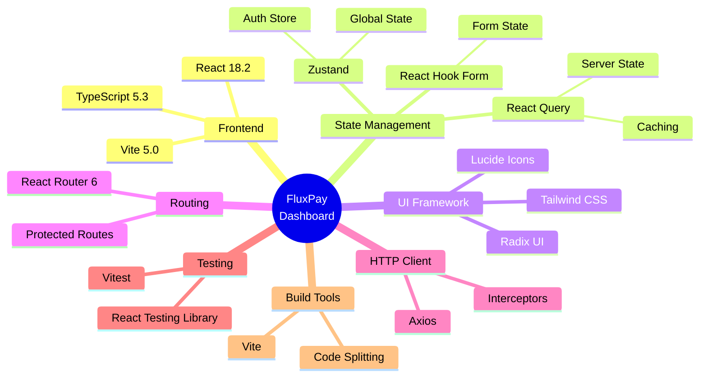

---

## Conclusion

FluxPay Dashboard represents a modern, enterprise-grade React application built with best practices and cutting-edge technologies. The project demonstrates:

- **Scalable Architecture**: Feature-based modular structure
- **Type Safety**: Full TypeScript coverage with strict mode
- **State Management**: Hybrid approach with Zustand and React Query
- **Performance**: Code splitting, caching, and optimization strategies
- **Developer Experience**: Comprehensive tooling and clear patterns
- **User Experience**: Responsive design, error handling, and real-time updates

### Key Strengths

1. **Maintainability**: Clear separation of concerns and consistent patterns
2. **Scalability**: Feature-based architecture allows easy extension
3. **Type Safety**: TypeScript prevents runtime errors
4. **Performance**: Optimized bundle size and efficient data fetching
5. **Developer Experience**: Modern tooling and comprehensive documentation

### Future Enhancements

Potential areas for future development:

- **Code Splitting**: Implement route-based lazy loading
- **Testing**: Increase test coverage to >80%
- **Performance**: Implement virtual scrolling for large lists
- **Accessibility**: Enhance ARIA labels and keyboard navigation
- **PWA**: Add service worker for offline support
- **Internationalization**: Multi-language support

---

**Document Version**: 1.0.0  
**Last Updated**: 2024  
**Maintained By**: FluxPay Development Team